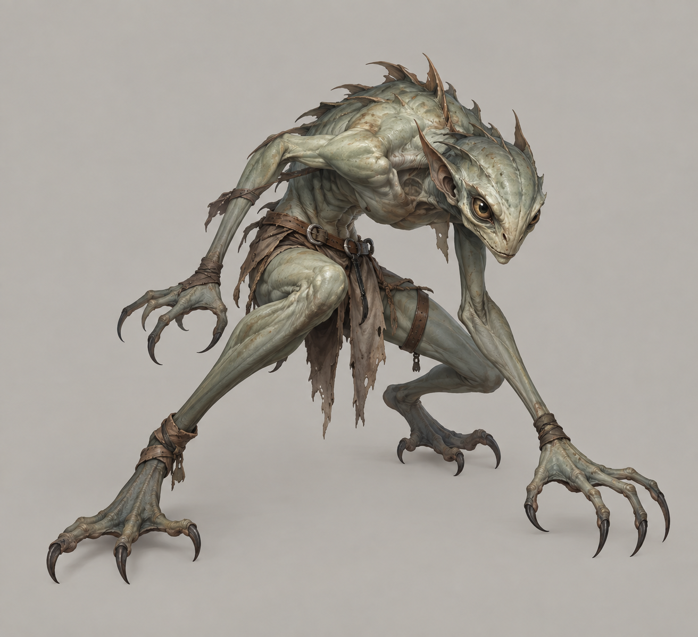
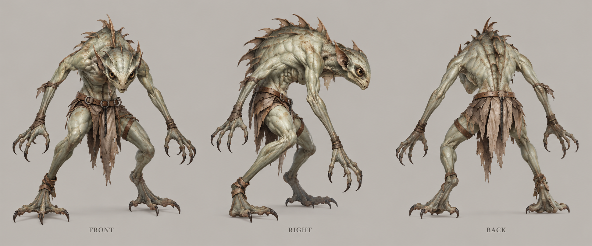

# 攀墙鬼

| 文档属性 | 内容 |
|---|---|
| 敌人编号 | ENM-005 |
| 版本 | v0.3 |
| 更新日期 | 2026-10-08 |
| 状态 | 「可以跨越围墙、接近时移速快、跨越后移速慢下来」已确定；数值与其余行为为设计提案 |
| 规则依赖 | [SYS-CBT-001 · 战斗与护甲规则](../系统/战斗与护甲规则.md) · [SYS-MOV-001 · 距离与移动速度标准](../系统/距离与移动速度标准.md) · [SYS-BHV-001 · 单位行为与警戒规则](../系统/单位行为与警戒规则.md) |

[返回文档目录](../../游戏设计文档.md)

## 1. 单位定位

攀墙鬼是**专门绕过城墙的突袭敌人**（已确定）：接近时跑得很快，遇到围墙**直接翻过去**而不是拆墙；但翻过去之后速度会慢下来。

其他绿皮遇墙都是「就近拆墙」（见[普通绿皮](普通绿皮.md)），玩家习惯了靠城墙拖住敌人。攀墙鬼让「墙后面什么都不放」变得危险：翻进来的敌人会落在防线内侧，打到开拓者、民兵和塔的后背。

它血少、单个不强，威胁是**落点**，玩家需要在墙后留一手（近战单位、雷环塔、凝霜塔）。

名称取自它翻墙的方式：像壁虎一样扒着墙头翻过去。

## 2. 属性表（设计提案）

| 属性 | 当前设定 | 状态 |
|---|---|---|
| 最大生命值 | **120** | 设计提案，比普通绿皮低，翻进来后要能被处理 |
| 护甲 | **0** | 设计提案 |
| 攻击力 | **15** / 次，近战单体 | 设计提案 |
| 攻击间隔 | **1.2 秒**（每秒伤害 12.5） | 设计提案 |
| 攻击距离 | **1 m** | 设计提案 |
| 移动速度 | **5.0 m/s**（很快档），翻墙后降为 **2.2 m/s**（慢档） | 快慢变化已确定；数值为设计提案 |
| 视野 / 警戒 | **10 m / 10 m** | 设计提案 |
| 击杀奖励 | 随机 **240–400** 金币 | 设计提案 |
| 魔晶掉落 | **20%** 概率掉落 **1** 魔晶 | 设计提案 |

## 3. 跃墙规则（设计提案）

| 规则 | 内容 |
|---|---|
| 触发 | 前进路线被[城墙](../建筑/军事建筑/城墙.md)或城门挡住时，就近选一处**直接翻越**，不拆墙 |
| 可翻越 | 单层城墙和城门（厚 1 m）；墙外紧贴的第二层墙不能翻，只能拆 |
| 不可翻越 | 建筑本体、悬崖、水面 |
| 翻越动作 | 起跳到落地约 **0.8 秒**，期间可被攻击，不无敌 |
| 落点 | 墙的内侧约 1–2 m |
| 翻越后 | 移动速度降为 **2.2 m/s**，**一直保持**，不会恢复 |
| 翻越次数 | 每只只翻一次；落地后再遇墙就像普通绿皮一样拆墙 |

**为什么翻墙后要变慢：**快速跑到墙前是它的强项，翻进来之后如果还保持 5 m/s，就没有任何东西追得上它。变慢之后，玩家的近战单位和塔有时间处理，代价是玩家必须在墙后有人。

**备选方案（待定）：**翻越后只慢一段时间（例如 8 秒）再恢复。目前选择永久变慢，实现更简单，也更容易预判。

## 4. 行为（设计提案）

| 规则 | 内容 |
|---|---|
| 进攻目标 | 向主城方向推进 |
| 翻墙后的目标 | 优先攻击最近的**单位**，其次是建筑（专门找开拓者、火枪手这类脆弱目标） |
| 撤退 | 不撤退，打到死为止 |
| 夜视 | 夜间视野不受惩罚 |

## 5. 强度检验

| 对象 | 结果 |
|---|---|
| 穿过 60 m 空地 | 约 12 秒（普通绿皮约 20 秒） |
| 翻入墙内后 vs [开拓者](../单位/开拓者.md) | 2.2 m/s 低于开拓者的 2.5 m/s，开拓者能跑开，但被贴上就跑不掉 |
| 箭塔（20 点，1.5 秒）消灭一只 | 6 发，约 7.5 秒 |
| [雷环塔](../建筑/军事建筑/雷环塔.md) | 20 秒，翻进环里后基本跑不掉 |
| [凝霜塔](../建筑/军事建筑/凝霜塔.md) | 减速叠加在 2.2 m/s 上，几乎走不动 |

**设计意图：**
- 血少速度快，箭塔来不及在墙前打掉它。
- 翻过墙后变慢，墙后布置雷环塔、凝霜塔或几个近战单位的玩家轻松处理；只靠一圈墙的玩家会被撕开后方。

## 6. 待设计内容

| 项目 | 需确定内容 |
|---|---|
| 翻越判定 | 具体从墙的哪个位置起跳（就近、还是找最薄的地方） |
| 是否针对城门 | 城门是否也翻，还是当作普通墙 |
| 美术 | 起跳与落地动画，轻装、身上有攀爬钩爪等特征 |
| 出场 | 何时出现、每波数量，留到出怪阶段设计 |

## 7. 关联文档

[普通绿皮](普通绿皮.md) · [城墙](../建筑/军事建筑/城墙.md) · [雷环塔](../建筑/军事建筑/雷环塔.md) · [凝霜塔](../建筑/军事建筑/凝霜塔.md) · [开拓者](../单位/开拓者.md) · [距离与移动速度标准](../系统/距离与移动速度标准.md)

## 8. 版本记录

| 版本 | 日期 | 变更 |
|---|---|---|
| v0.1 | 2026-09-30 | 建立文档：可翻越围墙的快速敌人，翻墙后减速；数值为设计提案 |
| v0.2 | 2026-09-30 | 定名攀墙鬼；原名跃墙者 |
| v0.3 | 2026-10-08 | 金币数量级整体 ×20（价格、维持费、奖励同比放大，平衡不变） |

<!-- art-20261005:start -->
## 美术设定图补充（2026-10-05）

本批补充概念稿和正面、侧面、背面三视图。用于造型与材质参考；建模时统一尺寸、结构和各视图细节。俯视图与动画另行制作。

### 攀墙鬼

[概念稿提示词](../美术/主城/敌人与建筑设定图/攀墙鬼-概念图-v1-提示词.txt) · [三视图提示词](../美术/主城/敌人与建筑设定图/攀墙鬼-三视图-v1-提示词.txt)

<!-- art-20261005:end -->

<!-- enemy-baseline-20261008:start -->
## 第二轮原型预算与结算（2026-10-08）

本轮威胁点 **3**；根谱系本人击杀10XP/点、15米内友方击杀5XP/点；分裂子代不重复送XP/老兵星数/预算，但金币仍按原个体规则。基础HP、甲、单次攻击与速度沿本页，不以普遍涨生命制造难度。出场构成和时间唯一见[生存数值配置](../系统/生存数值配置.md)。

推进目标统一最近合法建筑，遇局部单位/墙按行为规则交战；不是无限直奔主城。特殊本体能力（魔免、越墙、五投矛、分裂、快慢差异）保留。大波及根谱系子代/生成队列清零才开始休整，母体死亡不提前清场。

| 版本 | 日期 | 变更 |
|---|---|---|
| 2026.10.08-B2 | 2026-10-08 | 统一威胁点、成长与谱系清场；原型需试玩 |
<!-- enemy-baseline-20261008:end -->
