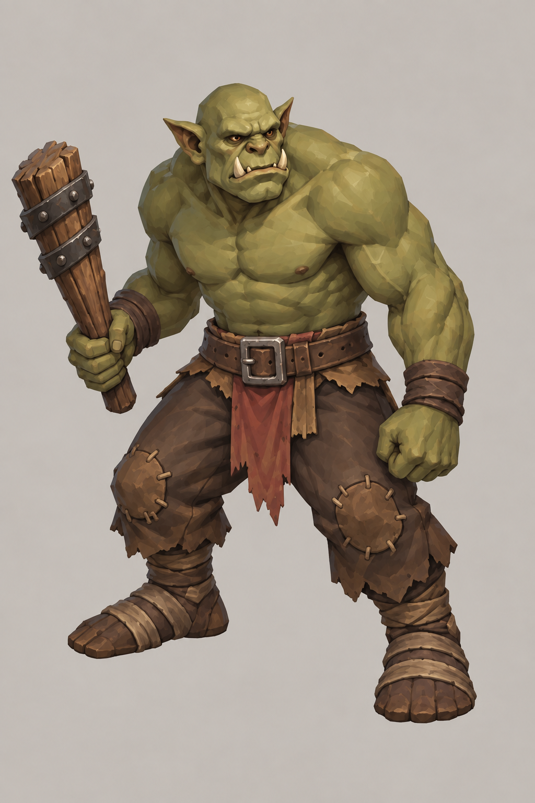
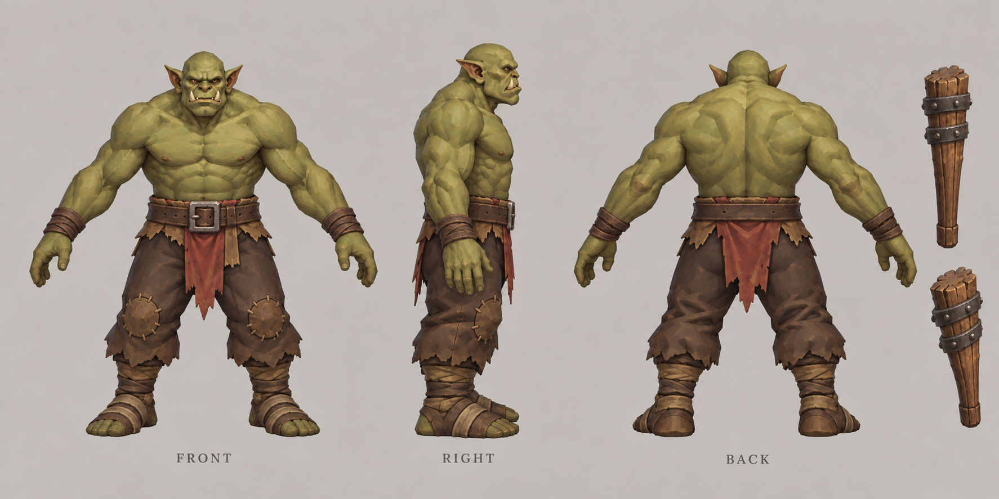

# 普通绿皮

| 文档属性 | 内容 |
|---|---|
| 敌人编号 | ENM-001 |
| 版本 | v0.3 |
| 更新日期 | 2026-09-29 |
| 状态 | 击杀奖励、遇墙拆墙、不撤退已确定；属性与其余行为为设计提案 |
| 规则依赖 | [SYS-CBT-001 · 战斗与护甲规则](../系统/战斗与护甲规则.md) · [SYS-MOV-001 · 距离与移动速度标准](../系统/距离与移动速度标准.md) · [SYS-BHV-001 · 单位行为与警戒规则](../系统/单位行为与警戒规则.md) |

[返回文档目录](../../游戏设计文档.md)

## 1. 单位定位

普通绿皮是绿皮进攻的主力：**数量多、单体中等的近战步兵**。单只比民兵强，但打不过防御工事，威胁来自成群进攻。

「普通绿皮」为当前通用名称，正式名称待定，候选：绿皮小子、绿皮战士、绿皮步兵。绿皮的起源、组织与动机待定，见 [世界观与角色](../世界观与角色.md)。

## 2. 属性表

| 属性 | 当前设定 | 状态 |
|---|---|---|
| 最大生命值 | **200** | 设计提案 |
| 护甲 | **0** | 设计提案 |
| 攻击力 | **20** / 次，近战单体 | 设计提案 |
| 攻击间隔 | **1.5 秒**（每秒伤害约 13.3） | 设计提案 |
| 攻击距离 | **1 m** | 设计提案 |
| 移动速度 | **3 m/s**（标准档） | 设计提案 |
| 视野 | **10 m** | 设计提案 |
| 警戒距离 | **10 m** | 设计提案；比民兵（8 m）大，看见就冲 |
| 击杀奖励 | **随机 10–20 金币** | 已确定 |
| 魔晶掉落 | **20%** 概率掉落 **1–2** 魔晶 | 掉落魔晶已确定；概率与数量为设计提案 |

属性沿用此前各文档强度检验使用的测试值。采用后，箭塔、哨塔、兵营、城墙、民兵文档中的检验结果即为正式结果。

## 3. 击杀奖励

**击杀普通绿皮随机获得 10–20 金币**（已确定），期望约 15 金币。

设计提案：

- 在 10–20 之间均匀随机取整数。
- 金币直接计入资源，不需要拾取。
- 无论被士兵还是箭塔击杀都获得奖励。

**魔晶掉落：**击杀普通绿皮会掉落魔晶（已确定），提案为 20% 概率掉落 1–2 个，直接计入资源。魔晶是魔法路线的主要资源，见 [核心玩法循环](../核心玩法循环.md)。

**定位：**经营是主要收入，击杀奖励只是补充。原定 50–100 金币时，一波进攻的奖励可达数分钟的经营收入，因此下调。一波 10 只绿皮约 150 金币，不到一座住满木屋 2 分钟的产出。见 [成本体系](../系统/成本体系.md)。

## 4. 行为

| 规则 | 内容 | 状态 |
|---|---|---|
| 进攻目标 | 以主城为最终目标，朝主城方向推进 | 设计提案 |
| 途中遇敌 | 警戒范围内出现单位或建筑，先攻击最近的目标 | 设计提案 |
| 遇墙 | 就近拆墙，不绕远路 | 已确定 |
| 撤退 | 不撤退，打到死为止 | 已确定 |
| 夜视 | 夜间视野不受惩罚 | 设计提案 |

**夜视提案：**绿皮夜间视野不受影响，而玩家单位的夜间视野会缩小。夜晚成为绿皮的主场，[哨塔](../建筑/哨塔.md)的灯光因此更加重要。

## 5. 强度检验

| 对象 | 结果 |
|---|---|
| vs [民兵](../单位/民兵.md) | 1 对 1 绿皮胜；2 个民兵可稳定击败 1 只 |
| vs [开拓者](../单位/开拓者.md) | 5 次命中，约 6 秒 |
| vs [箭塔](../建筑/箭塔.md) | 1 对 1 箭塔胜；2 只绿皮可拆掉 1 座箭塔 |
| 1 只拆 [兵营](../建筑/兵营.md) | 约 17 秒 |
| 1 只拆箭塔 / [哨塔](../建筑/哨塔.md) | 约 25 秒 / 约 26 秒 |
| 1 只打穿 [城墙](../建筑/城墙.md) 墙段 | 约 3 分 45 秒 |

**注意：**开拓者速度 2.5 m/s，低于绿皮的 3 m/s，被盯上后无法逃脱。当前理解为「开拓者必须被保护」；如果过于严苛，可以提高开拓者速度，或让绿皮优先攻击士兵和建筑。

## 6. 待设计内容

| 项目 | 需确定内容 |
|---|---|
| 进攻节奏 | 每波数量、间隔、强度增长 |
| 目标优先级 | 是否优先攻击某类目标 |
| 其他绿皮 | 远程、攻城、精英等兵种 |
| 美术 | 概念图与模型规范 |

## 7. 关联文档

[民兵](../单位/民兵.md) · [开拓者](../单位/开拓者.md) · [箭塔](../建筑/箭塔.md) · [哨塔](../建筑/哨塔.md) · [兵营](../建筑/兵营.md) · [城墙](../建筑/城墙.md) · [单位行为与警戒规则](../系统/单位行为与警戒规则.md) · [核心玩法循环](../核心玩法循环.md)

## 8. 版本记录

| 版本 | 日期 | 变更 |
|---|---|---|
| v0.1 | 2026-09-27 | 建立文档：确定击杀奖励随机 50–100 金币；提出沿用测试值的属性、行为与夜视 |

### 普通绿皮设定图

造型提案 v3（2026-09-30）：概念稿与正面／右侧／背面三视图独立成图。人物采用 A-pose，手持装备单独展示。沿用既有造型与玩法设定，建模时仍需统一精确尺寸与细节。

[概念图提示词](../美术/主城/敌人与建筑设定图/普通绿皮-概念图-v3-提示词.txt) · [三视图提示词](../美术/主城/敌人与建筑设定图/普通绿皮-Apose三视图-v3-提示词.txt)

[历史合版](../美术/主城/敌人与建筑设定图/普通绿皮-设定图-v1.png)

[生成提示词](../美术/主城/敌人与建筑设定图/普通绿皮-提示词-v1.txt)
| v0.2 | 2026-09-28 | 击杀奖励改为随机 10–20 金币 |
| v0.3 | 2026-09-29 | 击杀可掉落魔晶 |
