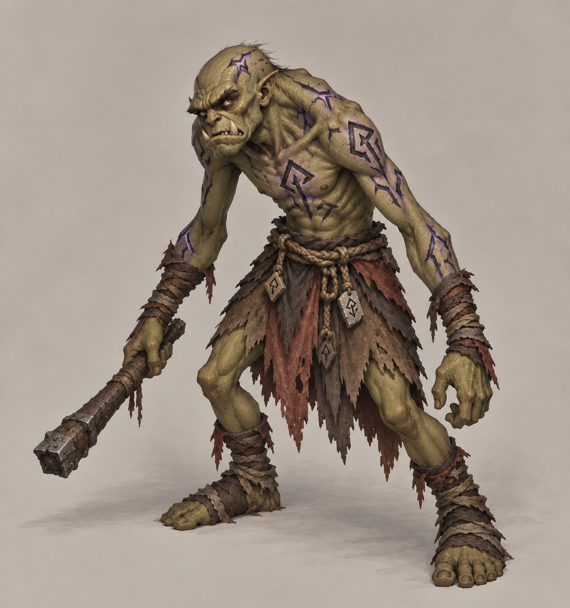
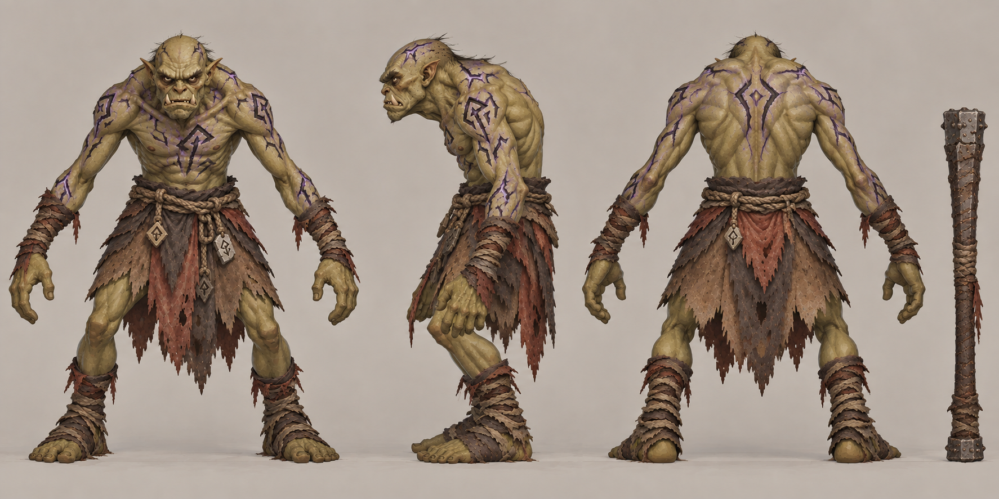

# 破咒小子

| 文档属性 | 内容 |
|---|---|
| 敌人编号 | ENM-003 |
| 版本 | v0.3 |
| 更新日期 | 2026-10-08 |
| 状态 | 魔法免疫的绿皮已确定，名称破咒小子；全部属性与行为为设计提案 |
| 规则依赖 | [SYS-CBT-001 · 战斗与护甲规则](../系统/战斗与护甲规则.md) · [SYS-MOV-001 · 距离与移动速度标准](../系统/距离与移动速度标准.md) · [SYS-BHV-001 · 单位行为与警戒规则](../系统/单位行为与警戒规则.md) |

[返回文档目录](../../游戏设计文档.md)

## 1. 单位定位

破咒小子是绿皮一族中**魔法免疫的近战单位**（已确定）：**血厚、有护甲、完全不受魔法影响**，是专门用来限制魔法路线的敌人。

魔法伤害无视护甲（见[战斗与护甲规则](../系统/战斗与护甲规则.md)），意味着魔法一侧对高护甲敌人有天然优势。破咒小子给这个优势设了一个反例：**魔法对它完全无效**，只有物理输出能打，让走单一魔法路线的玩家必须补一些物理单位或塔，鼓励魔法与科技（物理）搭配。

**名称说明：**「破咒小子」参考战锤兽人的命名方式：单位名不带种族名，靠「小子」这个后缀表明是绿皮一族（对应战锤的 Boyz），「破咒」表示它专门克制魔法。备选：符文小子、铁颅小子、拒咒佬。

## 2. 属性表

| 属性 | 当前设定 | 状态 |
|---|---|---|
| 魔法免疫 | 不受任何魔法伤害与魔法效果 | 已确定 |
| 最大生命值 | **300** | 设计提案，约为普通绿皮的 1.5 倍 |
| 护甲 | **10**（减伤 25%） | 设计提案，让物理输出打折扣，作为魔法免疫的补偿之一 |
| 攻击力 | **20** / 次，近战单体 | 设计提案，与普通绿皮相同 |
| 攻击间隔 | **1.5 秒**（每秒伤害 13.3） | 设计提案 |
| 攻击距离 | **1 m** | 设计提案 |
| 移动速度 | **2.8 m/s**（标准档下沿） | 设计提案，比普通绿皮略慢 |
| 视野 | **10 m** | 设计提案 |
| 警戒距离 | **10 m** | 设计提案 |
| 击杀奖励 | 随机 **400–600** 金币 | 设计提案，比普通绿皮（200–400）高 |
| 魔晶掉落 | **30%** 概率掉落 **1–2** 魔晶 | 设计提案，略高于普通绿皮的 20% |

## 3. 魔法免疫规则（设计提案）

| 规则 | 内容 |
|---|---|
| 魔法伤害 | 完全无效，不受任何魔法伤害，包括[凝霜](../建筑/军事建筑/凝霜塔.md)、[雷环塔](../建筑/军事建筑/雷环塔.md)、[裁决](../建筑/军事建筑/裁决.md)、[古塞奇尤](../单位/古塞奇尤.md)的攻击与连环闪电、[法师](../单位/法师.md)的攻击与魔法龙破斩 |
| 魔法效果 | 免疫魔法附带的效果，例如凝霜的减速 |
| 物理伤害 | 正常受伤，按护甲减免：箭矢、火枪、近战、圣堂刺客的百分比伤害都有效 |
| 技能穿透 | 连环闪电不会跳向它；魔法龙破斩会穿过它，照常伤害线上的其他敌人 |
| 自动索敌 | 只有魔法攻击的单位或塔，**自动索敌会跳过它**，不会把攻击和裁决的秒杀浪费在它身上 |
| 友军魔法 | 不影响友方效果，例如牧师治疗友军、魔导护盾器保护友方塔 |

**为什么自动索敌要跳过它：**否则雷环塔以外的魔法塔会一直对着免疫单位空放，玩家会觉得塔坏了。跳过它之后，魔法单位会去打其他目标，只剩它自己时则停止攻击。

## 4. 行为（设计提案）

与[普通绿皮](普通绿皮.md)基本一致：

| 规则 | 内容 |
|---|---|
| 进攻目标 | 以主城为最终目标，朝主城方向推进 |
| 途中遇敌 | 警戒范围内出现单位或建筑，先攻击最近的目标 |
| 遇墙 | 就近拆墙，不绕远路 |
| 撤退 | 不撤退，打到死为止 |
| 夜视 | 夜间视野不受惩罚 |

## 5. 强度检验

普通绿皮属性以设计提案为准：**200 生命、20 攻击、1.5 秒攻击间隔、无护甲、近战**。

| 项目 | 结果 |
|---|---|
| 破咒小子每次对箭塔的实际伤害 | 20 × 30 ÷ 33 ≈ 18.2 |
| 一只破咒小子拆掉满血箭塔 | 17 次命中，约 24 秒 |
| 箭塔每次对破咒小子的实际伤害 | 20 × 30 ÷ 40 = 15 |
| 箭塔消灭一只破咒小子 | 20 次命中，约 28.5 秒 |
| 1 座箭塔 vs 1 只破咒小子 | 箭塔略处下风 |
| 魔法单位或塔 vs 破咒小子 | 无效 |
| [圣骑士](../单位/圣骑士.md) vs 1 只破咒小子 | 圣骑士胜，回血让他稳赢 |
| [骑士](../单位/骑士.md)（3 本）vs 1 只破咒小子 | 骑士胜，约 16.5 秒 |
| [火枪手](../单位/火枪手.md) | 每发 30 点，需要 10 发 |

**设计意图：**
- 它比普通绿皮更耐打，一座箭塔单独处理不了。
- 魔法完全无效，逼迫玩家集中处理：火枪手集火、骑士和圣骑士近战、圣堂刺客的百分比伤害（对 300 血的目标首击额外伤害 60）。
- 走单一魔法路线的玩家，在遇到破咒小子时会发现古塞奇尤、法师、凝霜、雷环塔都帮不上忙，必须补一些物理输出。这让魔法与科技两条路线互相需要，不会一边倒。

## 6. 待设计内容

| 项目 | 需确定内容 |
|---|---|
| 免疫范围 | 是否也免疫牧师对友方以外的魔法（暂无）；是否只免疫伤害不免疫控制 |
| 数值 | 血量、护甲、速度是否合适 |
| 出场 | 何时出现、每波数量，留到出怪阶段设计 |
| 美术 | 概念图与模型规范，身上有符文或护符等抗魔标识，沿用普通绿皮的手绘风格 |

## 7. 关联文档

[普通绿皮](普通绿皮.md) · [绿皮弓手](绿皮弓手.md) · [战斗与护甲规则](../系统/战斗与护甲规则.md) · [凝霜塔](../建筑/军事建筑/凝霜塔.md) · [雷环塔](../建筑/军事建筑/雷环塔.md) · [裁决](../建筑/军事建筑/裁决.md) · [古塞奇尤](../单位/古塞奇尤.md) · [法师](../单位/法师.md)

## 8. 版本记录

| 版本 | 日期 | 变更 |
|---|---|---|
| v0.1 | 2026-09-29 | 建立文档：魔法免疫的近战绿皮；数值为设计提案 |
| v0.2 | 2026-09-29 | 定名为破咒小子，参考战锤兽人的命名方式（不带种族名，靠「小子」后缀） |
| v0.3 | 2026-10-08 | 金币数量级整体 ×20（价格、维持费、奖励同比放大，平衡不变） |

### 破咒小子概念图（2026-09-30 美术提案）

造型、配色、服装及装饰为美术提案，尚未确认为最终设定；玩法与数值以本文原有规则为准。

[生成提示词](../美术/主城/敌人与建筑设定图/破咒小子-概念图-v3-提示词.txt) · [设定图索引](../美术/主城/敌人与建筑设定图/设定图索引.md)

**2026-09-30 修订说明（v3，图稿待确认）：**按用户反馈由厚重铁甲改为裸肤符文与阴沉气质：收窄躯干、佝偻姿态、皮下暗紫符文与小型近战棍棒。魔法免疫与近战定位保留；原有生命值、护甲等数值仍是玩法提案，本次未调整。

[旧稿 v1](../美术/主城/敌人与建筑设定图/破咒小子-概念图-v1.png) · [旧稿提示词](../美术/主城/敌人与建筑设定图/破咒小子-概念图-v1-提示词.txt) · [单位强度视觉分层提案](../美术/主城/敌人与建筑设定图/单位强度视觉分层提案.md)

[过渡稿 v2](../美术/主城/敌人与建筑设定图/破咒小子-概念图-v2.png) · [过渡稿提示词](../美术/主城/敌人与建筑设定图/破咒小子-概念图-v2-提示词.txt)

### 破咒小子三视图（2026-10-01）

以当前概念图为参考的正面、右侧和背面美术图。建模前需校准尺寸、遮挡与细部。

[生成提示词](../美术/主城/敌人与建筑设定图/破咒小子-Apose三视图-v3-提示词.txt)

<!-- enemy-baseline-20261008:start -->
## 第二轮原型预算与结算（2026-10-08）

本轮威胁点 **4**；根谱系本人击杀10XP/点、15米内友方击杀5XP/点；分裂子代不重复送XP/老兵星数/预算，但金币仍按原个体规则。基础HP、甲、单次攻击与速度沿本页，不以普遍涨生命制造难度。出场构成和时间唯一见[生存数值配置](../系统/生存数值配置.md)。

推进目标统一最近合法建筑，遇局部单位/墙按行为规则交战；不是无限直奔主城。特殊本体能力（魔免、越墙、五投矛、分裂、快慢差异）保留。大波及根谱系子代/生成队列清零才开始休整，母体死亡不提前清场。

| 版本 | 日期 | 变更 |
|---|---|---|
| 2026.10.08-B2 | 2026-10-08 | 统一威胁点、成长与谱系清场；原型需试玩 |
<!-- enemy-baseline-20261008:end -->
