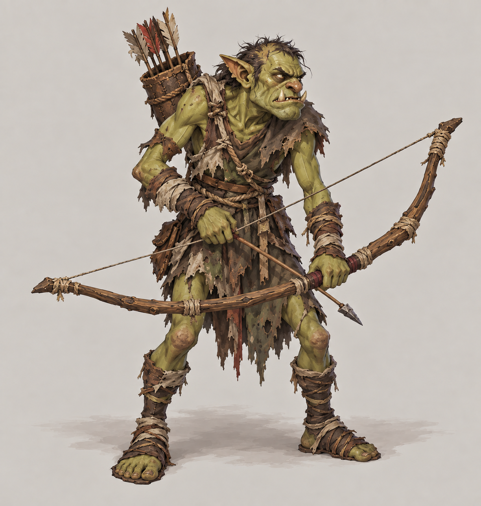
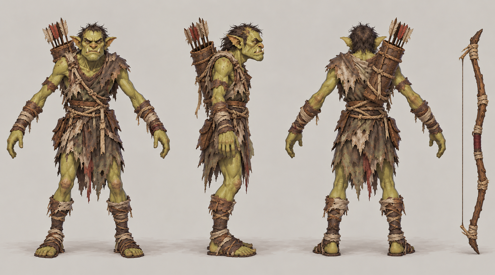

# 绿皮弓手

| 文档属性 | 内容 |
|---|---|
| 敌人编号 | ENM-002 |
| 版本 | v0.2 |
| 更新日期 | 2026-10-08 |
| 状态 | 草案：为了让远程单位的对策技能（骑士的猎手）有对象而建立；全部属性与行为为设计提案 |
| 规则依赖 | [SYS-CBT-001 · 战斗与护甲规则](../系统/战斗与护甲规则.md) · [SYS-MOV-001 · 距离与移动速度标准](../系统/距离与移动速度标准.md) · [SYS-BHV-001 · 单位行为与警戒规则](../系统/单位行为与警戒规则.md) |

[返回文档目录](../../游戏设计文档.md)

## 1. 单位定位

绿皮弓手是绿皮中的**远程单位**：**血少、站在后排、远程输出**。它自己不冲上来拆墙，而是躲在近战绿皮后面射击，成为玩家必须解决的第二层威胁。

它的存在给出了两个设计目的：
- 让[骑士](../单位/骑士.md)「对远程单位额外造成 50% 伤害」的技能有明确对象。
- 打破「只有近战杂兵」的单调，让玩家需要不同类型的单位与塔。

## 2. 属性表

| 属性 | 当前设定 | 状态 |
|---|---|---|
| 最大生命值 | **100** | 设计提案，约为普通绿皮的一半 |
| 护甲 | **0** | 设计提案 |
| 攻击力 | **15** / 次，远程单体 | 设计提案 |
| 攻击间隔 | **2.0 秒**（每秒伤害 7.5） | 设计提案 |
| 攻击距离 | **9 m** | 设计提案，比箭塔（10 m）和火枪手（10 m）短，先被打到 |
| 移动速度 | **3 m/s**（标准档） | 设计提案 |
| 视野 | **10 m** | 设计提案 |
| 警戒距离 | **9 m** | 设计提案 |
| 击杀奖励 | 随机 **300–500** 金币 | 设计提案，比普通绿皮（200–400）高一点 |
| 魔晶掉落 | **20%** 概率掉落 **1–2** 魔晶 | 设计提案，与普通绿皮一致 |

## 3. 行为（设计提案）

| 规则 | 内容 |
|---|---|
| 进攻目标 | 与普通绿皮一致，向主城方向推进；途中遇到单位或建筑，先攻击射程内最近的目标 |
| 站位 | 走到离目标 9 m（攻击距离）时停下射击，不继续贴近 |
| 撤退 | 不撤退，打到死为止，与普通绿皮一致 |
| 被近战单位贴近 | 继续原地射击，不主动逃跑 |
| 夜视 | 夜间视野不受惩罚，与普通绿皮一致 |

## 4. 强度检验

| 项目 | 结果 |
|---|---|
| 弓手每次对箭塔的实际伤害 | 15 × 30 ÷ 33 ≈ 13.6 |
| 箭塔消灭一只弓手 | 5 次命中，约 7.5 秒 |
| 1 只弓手 vs 1 座箭塔 | 箭塔胜；箭塔射程更远，先射 |
| 3 只弓手 vs 1 座箭塔 | 箭塔被拆，只消灭 2 只左右 |
| [火枪手](../单位/火枪手.md)消灭一只弓手 | 3 次命中，约 5 秒 |
| [骑士](../单位/骑士.md)消灭一只弓手 | 猎手加成后 2 次命中，约 1.5 秒 |
| 民兵消灭一只弓手 | 7 次命中，约 9 秒 |

**设计意图：**
- 弓手单独几乎无害，成群站在后面射时才有威胁。
- 弓手的射程（9 m）比箭塔和火枪手都短，玩家可以靠射程优势在它开火前先打；但躲在近战绿皮后面时，塔和火枪手往往打不到它。这就给了骑士这种能绕过前排的单位用武之地。

## 5. 待设计内容

| 项目 | 需确定内容 |
|---|---|
| 数值 | 血量、伤害、射程是否合适 |
| 行为 | 是否优先攻击某类目标（例如开拓者、牧师） |
| 美术 | 概念图与模型规范，沿用普通绿皮的手绘风格 |
| 出场 | 何时出现、每波数量，留到出怪阶段设计 |

## 6. 关联文档

[普通绿皮](普通绿皮.md) · [骑士](../单位/骑士.md) · [火枪手](../单位/火枪手.md) · [箭塔](../建筑/军事建筑/箭塔.md) · [单位行为与警戒规则](../系统/单位行为与警戒规则.md)

## 7. 版本记录

| 版本 | 日期 | 变更 |
|---|---|---|
| v0.1 | 2026-09-29 | 建立草案：远程绿皮，为骑士的猎手技能提供对象 |
| v0.2 | 2026-10-08 | 金币数量级整体 ×20（价格、维持费、奖励同比放大，平衡不变） |

### 绿皮弓手概念图（2026-09-30 美术提案）

造型、配色、服装及装饰为美术提案，尚未确认为最终设定；玩法与数值以本文原有规则为准。

[生成提示词](../美术/主城/敌人与建筑设定图/绿皮弓手-概念图-v2-提示词.txt) · [设定图索引](../美术/主城/敌人与建筑设定图/设定图索引.md)

**2026-09-30 修订说明（v2，图稿待确认）：**按用户反馈减少英俊游侠感：驼背、凶陋面部、稀乱头发、破布与粗木弓，突出粗陋的后排杂兵形象。

[旧稿 v1](../美术/主城/敌人与建筑设定图/绿皮弓手-概念图-v1.png) · [旧稿提示词](../美术/主城/敌人与建筑设定图/绿皮弓手-概念图-v1-提示词.txt) · [单位强度视觉分层提案](../美术/主城/敌人与建筑设定图/单位强度视觉分层提案.md)

### 绿皮弓手三视图（2026-10-01）

以当前概念图为参考的正面、右侧和背面美术图。建模前需校准尺寸、遮挡与细部。

[生成提示词](../美术/主城/敌人与建筑设定图/绿皮弓手-Apose三视图-v2-提示词.txt)

<!-- enemy-baseline-20261008:start -->
## 第二轮原型预算与结算（2026-10-08）

本轮威胁点 **2**；根谱系本人击杀10XP/点、15米内友方击杀5XP/点；分裂子代不重复送XP/老兵星数/预算，但金币仍按原个体规则。基础HP、甲、单次攻击与速度沿本页，不以普遍涨生命制造难度。出场构成和时间唯一见[生存数值配置](../系统/生存数值配置.md)。

推进目标统一最近合法建筑，遇局部单位/墙按行为规则交战；不是无限直奔主城。特殊本体能力（魔免、越墙、五投矛、分裂、快慢差异）保留。大波及根谱系子代/生成队列清零才开始休整，母体死亡不提前清场。

| 版本 | 日期 | 变更 |
|---|---|---|
| 2026.10.08-B2 | 2026-10-08 | 统一威胁点、成长与谱系清场；原型需试玩 |
<!-- enemy-baseline-20261008:end -->
