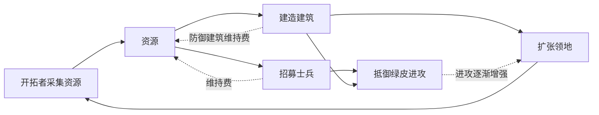

# 核心玩法循环

| 文档属性 | 内容 |
|---|---|
| 编号 | GDD-002 |
| 版本 | v0.18 |
| 更新日期 | 2026-10-08 |
| 状态 | 经营深度、资源种类、人口产生金币、单位维持费已确定（暂定，后续可调整）；维持费数值与各资源来源为设计提案 |

[返回文档目录](../游戏设计文档.md)

**模式与测试用途（2026-10-08用户确认）**：正式只有战役、生存；首战役负责操作教学，生存正常重复游玩。本页保留的S01/S01-L教学参数是内部短测历史对照，不是玩家教学关或每局前置。战役预设内容与正常生存配置分开，具体以[游戏模式与关卡](游戏模式与关卡.md)为准。

## 1. 经营深度

**采用中等经营深度**（已确定）。经营和防守同样重要，参考《They Are Billions》。

| 深度 | 参考 | 本项目 |
|---|---|---|
| 轻 | 《Warcraft III》：经营只为战斗服务 | 不采用 |
| **中** | 《They Are Billions》：资源、人口、维持消耗与防守并重 | **采用** |
| 重 | 《Banished》《RimWorld》：管理每个居民的需求 | 不采用 |

**核心矛盾：扩张与防守。**想发展就要向外扩张、占据更多资源；防线越拉越长，就需要更多士兵和防御塔；士兵和塔需要持续供养，又迫使玩家继续发展经济。

## 2. 玩法循环（设计提案）

1. **开拓者**采集资源、修建建筑。
2. **资源**用于建造、招募和供养。
3. **扩张**领地获得更多资源点，同时防线变长。
4. **士兵与需维护的防御建筑**需要持续支付维持费。
5. **绿皮**定期进攻且逐渐增强，逼迫玩家发展。
6. **科技**由主角的知识解锁，推动时代从中世纪走向科技化。

## 3. 资源

**资源共 5 种**（已确定，暂定，后续可调整）：

| 资源 | 定位 | 主要用途（设计提案） |
|---|---|---|
| **人口** | 基础资源，由民居提供 | 产生金币；开拓者、士兵从人口中出 |
| **金币** | 通用货币，由人口产生 | 建造、招募、维持费 |
| **钢铁** | 材料 | 武器、坚固建筑、建筑升级 |
| **能源** | 供给型：产出减占用，全局通用 | 灯光、法师营地与研究院升本、高本的塔；见 [能源体系](系统/能源体系.md) |
| **魔晶** | 这个世界本土的魔法资源 | 法师营地升本、魔法塔；由打怪掉落和地图宝箱获得 |

**人口产生金币**（已确定），与《They Are Billions》相同：**每名人口每分钟产出 180 金币**，被单位占用的人口不产出。2026-10-08 起金币数量级整体 ×20（原 9 金 → 180 金），所有价格同比放大，平衡不变。

**商店带来额外收入**（2026-10-07 已确定方向）：商店靠附近空闲居民光顾赚钱，叠加在税收之上，不改变「每人每分钟 180 金」。每名居民的消费只计算一次，税收加成与商店收入共同受该居民基础收入的 +100% 加成空间约束；商业结算与饱和预览见[城镇经营](系统/城镇经营.md)。

**击杀绿皮也获得金币**（已确定）：普通绿皮随机掉落 200–400 金币，作为经营收入的补充，见 [普通绿皮](敌人/普通绿皮.md)。

**钢铁来自[采矿场](建筑/经营建筑/采矿场.md)开采铁矿**（已确定），矿点在出生点附近刷出。能源由煤矿、油井、海上石油平台、太阳能发电站提供（已确定），见 [能源体系](系统/能源体系.md)。**魔晶来自打怪掉落和地图上散布的宝箱**（已确定），不设魔晶矿，见第 3.2 节。

### 3.1 各资源与现有设计的联系（设计提案）

- **能源与塔灯**：[哨塔](建筑/军事建筑/哨塔.md)的塔灯可以消耗能源。塔灯占用能源；能源不足时，已建成的塔灯照常亮，只是不能再建新的耗能建筑，见 [能源体系](系统/能源体系.md)。
- **钢铁与升级线**：箭塔可升级为箭塔 Lv2（即弩塔，需科技 2 本，价格 3000 金币 + 30 钢铁，累计 5400 金币 + 30 钢铁），体现从木石到金属的推进；火炮塔等是科技体系解锁的独立新塔，见 [科技系统](系统/科技系统.md)。
- **科技系统**：法师营地升本花费金币 + 魔晶，研究院升本花费金币 + 钢铁，两者升本后都持续占用能源，见 [科技系统](系统/科技系统.md)。

### 3.2 魔晶来源

**魔晶由打怪掉落和地图宝箱获得**（已确定）。魔法路线的资源和门槛（古塞奇尤等级）都来自作战，与科技路线靠经营建设形成对比。

**打怪掉落（设计提案）：**

| 敌人 | 掉落 |
|---|---|
| [普通绿皮](敌人/普通绿皮.md) | **20%** 概率掉落 **1–2** 魔晶，平均每只 0.3 |
| 以后的精英、首领类绿皮 | 掉落更多，必定掉落 |

按提案，击杀约 330 只普通绿皮可获得 100 魔晶，即建成法师营地（2 本）所需的量。掉落的魔晶和金币一样直接计入资源，不需要拾取。

**地图宝箱 = 野外营地（已确定）：**

| 规则 | 内容 |
|---|---|
| 分布 | 距离、可达路线与测试配置保底统一以[地图与资源点](系统/地图与资源点.md)为准，不沿用旧 60–150 m 草案 |
| 开启 | 登记守卫清零且营地被摧毁后解锁奖励；不要求英雄到场，营地不承担波次出怪 |
| 内容 | S01固定每营50魔晶；S02在营地生成时固定C，清场后选C魔晶或2C钢铁，只领一项、不附随机金币；结算与存档以地图规则为准 |
| 守卫 | 营地本身有绿皮驻守，不参与波次，见[出怪系统](系统/出怪系统.md) |
| 刷新 | 世界一次性生成，摧毁后不再补充，见[出怪系统](系统/出怪系统.md)和[地图与资源点](系统/地图与资源点.md) |

宝箱给玩家一个主动出城的理由，与「世界探索」这一核心活动相连。

营地材料选择是双主策采纳的原型规则：科技远征可加速钢铁投入，魔法远征保留升本资源。S01不开放二选一以免一次误选堵住教学成长；选择钢铁后不能继续把该营地魔晶算作已有资源。英雄是否得到经验，仍取决于本人击杀或实际15米附近覆盖。

**魔晶的兜底来源：**魔法 2 本的[炼金坊](建筑/经营建筑/炼金坊.md)可以把金币、钢铁按很差的汇率换成魔晶，每天有限额、每天刷新，只用于应急，不取代掉落和宝箱。

## 4. 人口

采用**民居产生人口**的方式（原方案 B，已确定），参考《They Are Billions》。民居共三级：木屋 10 人、瓦房 20 人、公寓 30 人，详见 [民居](建筑/经营建筑/民居.md)。主城提供 10 名初始人口，并生产开拓者。

- **规则层面**：人口是数字，按数字结算金币产出。
- **画面层面**：居民在民居和工作建筑之间走动，让基地更有生气；玩家不能控制居民。
- **实体单位**：开拓者、民兵是可操控的实体单位，从人口中出。

居民采用数字人口结算，画面上的居民活动不作为独立战斗单位。普通开拓者与士兵每名占用 1 人，舰船及特殊单位以各自属性表为准；同一人口只能被占用一次。人口归属、房屋战损后的容量与占用恢复见[民居](建筑/经营建筑/民居.md)及[成本体系](系统/成本体系.md)，不把税收与商业重复分配给被占用的人。

## 5. 维持费

### 5.1 已确定规则

单位除了招募时一次性付费，存活期间还需要持续支付维持费，参考《They Are Billions》。这样不需要硬性的单位上限，玩家会自己在经济和兵力之间找平衡。

1. **维持费扣金币**，单位部分相当于军饷，建筑部分用于驻守或设备补给维护。原先设想消耗食物，资源调整后改为金币。
2. **单位占用人口**：开拓者、士兵从人口中出，被占用的人口不再产生金币。造兵的代价是收入减少，维持费增加。
3. **高级兵种额外支付材料，部分对象持续占用能源**：金币、钢铁、魔晶按招募价格一次性支付；维持费按存活时间结算，能源按对象表持续占用。不能把招募材料再按分钟扣一次，详见[成本体系](系统/成本体系.md)。
4. **防御建筑不占用人口**：全自动箭塔和哨塔支付维持费，但不占用人口，避免规则过于复杂；哨塔仍有哨兵驻守。

**不设维持费的问题：**招募只花一次钱，后期兵力会无限膨胀，经营失去压力，同屏单位过多也影响性能和画面。

### 5.2 设计提案

- **维持费用于单位军饷、建筑驻守或设备补给维护**；是否收费及数额以各对象设定为准：

| 对象 | 维持费 | 理由 |
|---|---|---|
| [民兵](单位/民兵.md) | 100 金币 / 分钟 | |
| [开拓者](单位/开拓者.md) | 60 金币 / 分钟 | 降低开局压力 |
| [哨塔](建筑/军事建筑/哨塔.md) | 100 金币 / 分钟 | 有哨兵驻守 |
| [箭塔](建筑/军事建筑/箭塔.md) | 200 金币 / 分钟 | 全自动单箭机构的箭矢补给与维护，无人驻守 |
| [民居](建筑/经营建筑/民居.md) | 无（已确定） | 居民不是单位，只代表金币产出 |
| [兵营](建筑/军事建筑/兵营.md)、[主城](建筑/经营建筑/主城设计.md)、[城墙](建筑/军事建筑/城墙.md) | 无 | 无人驻守或属于基础设施 |

- **入不敷出时采用温和惩罚**，避免「缺钱 → 变弱 → 失地 → 更缺钱」的死亡螺旋。收支恢复后立即恢复：

| 对象 | 效果 |
|---|---|
| 士兵 | 攻击力下降（如 −30%），不会消失 |
| 哨塔 | 视野缩小 |
| 箭塔 | 攻击间隔变长 |
| 开拓者 | 建造速度变慢 |

以上金额已确定，所有价格见 [成本体系](系统/成本体系.md)。

### 5.3 现金宽裕立场（设计提案，第五轮裁决）

后期（约 29 分钟后）金币不再是主约束，取舍由钢铁、人口、空间、魔晶与英雄位置承担。立场：**接受现金宽裕**，不恢复主角雕像，不新增强制烧钱的建筑或税。验收口径补两项：增加「重兵力对照路线」（轻兵力脚本的金币过剩不能代表玩家）；记录「余额 / 最大单笔」曲线。若重兵力路线在 1800 秒后仍长时间无可买目标（余额 > 9 倍最大单笔且等待原因无资源），再评审金币出口。以上均未经真人试玩。

## 6. 待设计内容

| 项目 | 需确定内容 |
|---|---|
| 魔晶供给 | 按实际波次、英雄在场与可达营地验证升本时间；营地一次性生成，不刷新 |
| 人口 | 房屋战损与超容量边界，以民居和成本体系统一规则验证 |
| 数值 | 入不敷出时的惩罚幅度 |
| 建造成本 | 价格见成本体系 |
| 进攻节奏 | 绿皮进攻的频率与强度增长 |
| 科技 | 科技树结构、解锁条件 |

## 7. 关联文档

[项目总览](项目总览.md) · [开拓者](单位/开拓者.md) · [民兵](单位/民兵.md) · [箭塔](建筑/军事建筑/箭塔.md) · [哨塔](建筑/军事建筑/哨塔.md) · [兵营](建筑/军事建筑/兵营.md) · [主城设计](建筑/经营建筑/主城设计.md)

## 8. 版本记录

| 版本 | 日期 | 变更 |
|---|---|---|
| v0.1 | 2026-09-26 | 建立文档：确定中等经营深度、资源暂定 4 种、士兵与哨塔消耗食物；提出玩法循环、资源种类、人口与食物消耗方案 |
| v0.2 | 2026-09-26 | 资源改为人口、金币、钢铁、能源、魔晶 5 种；确定人口产生金币、民居产生人口；维持消耗推荐改用金币 |
| v0.3 | 2026-09-26 | 确定单位维持费：扣金币、单位占用人口、高级兵种额外占用资源；驻守建筑不占用人口 |
| v0.4 | 2026-09-27 | 确定每名人口每分钟 6 金币；补充民居三级人口 |
| v0.5 | 2026-09-27 | 民居维持费 50 金币 / 分钟 |
| v0.6 | 2026-09-27 | 人口产出改为每人每分钟 9 金币 |
| v0.7 | 2026-09-27 | 民居维持费改为 40 金币 / 分钟 |
| v0.8 | 2026-09-28 | 取消民居维持费；维持费改为直接写金额，不再使用「份数」 |
| v0.9 | 2026-09-28 | 击杀奖励改为 10–20 金币；维持费金额确定；价格移至成本体系 |
| v0.10 | 2026-09-28 | 钢铁来源确定为采矿场开采铁矿 |
| v0.11 | 2026-09-29 | 能源确定为供给型，来源为四种能源建筑 |
| v0.12 | 2026-09-29 | 魔晶来源确定为打怪掉落和地图宝箱 |
| v0.13 | 2026-10-07 | 加入商店额外收入，见城镇经营 |
| v0.14 | 2026-10-08 | 金币数量级整体 ×20（价格、收入、维持费、奖励同比放大，平衡不变），方便商店按秒跳金币数字 |
| v0.15 | 2026-10-08 | 数值迭代：同步商业空闲人口与收入上限口径、移除旧营地距离和过时人口待定项；测试基线与体验验证见数值总规划 |

| 版本 | 日期 | 变更 |
|---|---|---|
| v0.17 | 2026-10-08 | 同步战役/生存用途，S01仅内部对照 |
| v0.18 | 2026-10-08 | 第五轮同步：箭塔 Lv2 价格 3000 金+30 钢（累计 5400+30 钢）与需科技 2 本；删已有金额的待定项；新增 5.3 现金宽裕立场（设计提案）与验收补充 |
