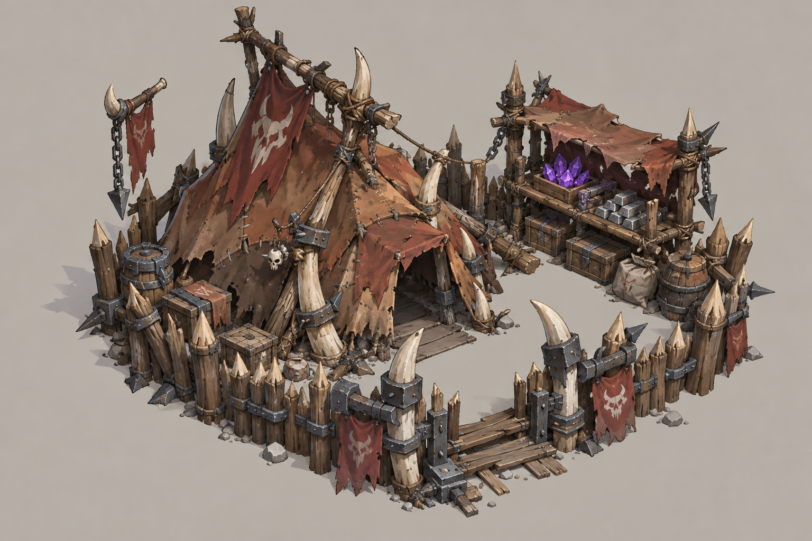
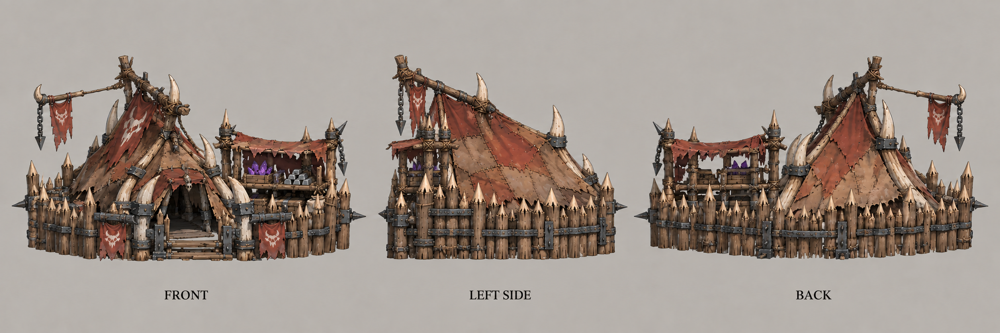
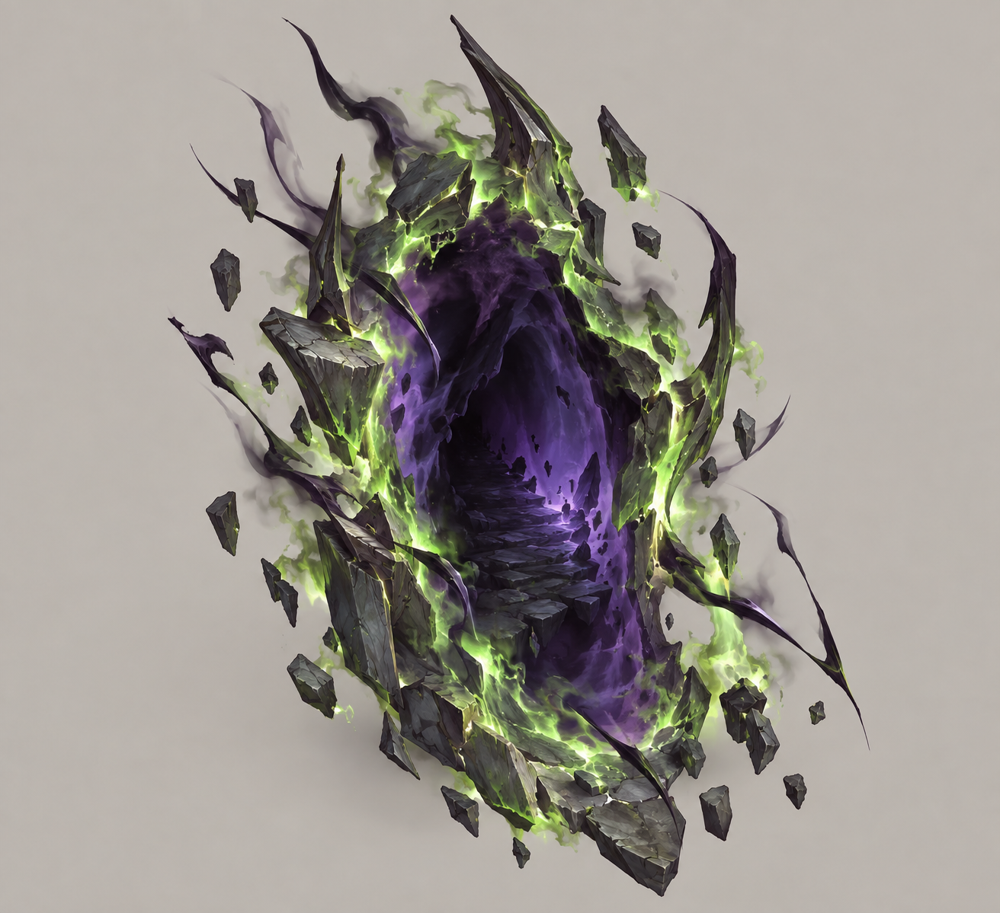
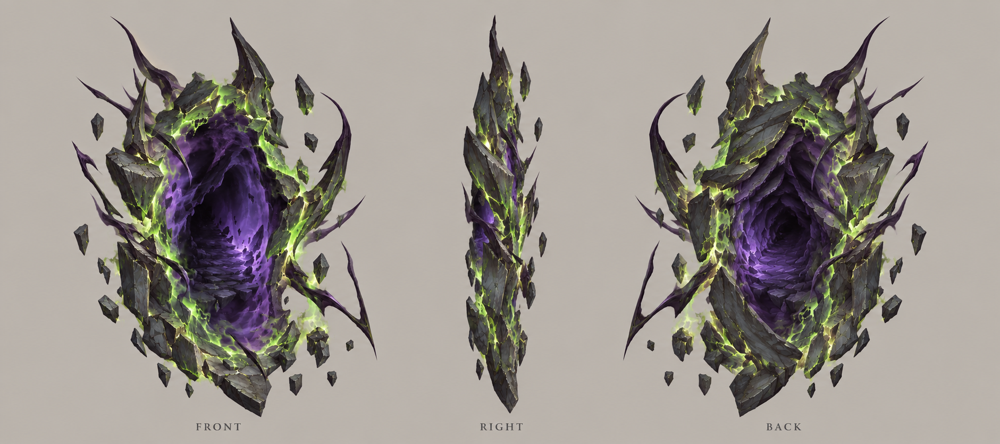

# 出怪系统

| 文档属性 | 内容 |
|---|---|
| 编号 | SYS-SPN-001 |
| 版本 | v1.0 |
| 更新日期 | 2026-10-08 |
| 状态 | 普通出怪、小波、大波三层节奏、一般经过 2–4 次小波出现一次大波已确定；迷雾随机传送门、最近建筑目标、营地只当宝箱、大波 1–2 个门并提示方向保留；三层预算、间隔与 24 个集中波的逐种构成见[生存数值配置](生存数值配置.md)（原型基线，未经真人试玩）；2–4 次小波的取值方式、空中敌人等仍待设计 |
| 规则依赖 | [SYS-MAP-001 · 地图与资源点](地图与资源点.md) · [SYS-BHV-001 · 单位行为与警戒规则](单位行为与警戒规则.md) · [SYS-MOV-001 · 距离与移动速度标准](距离与移动速度标准.md) |

[返回文档目录](../../游戏设计文档.md)

本轮复审补充：零合法门户是配置错误，不是正常玩法；发布版暂停整个模拟并提供返回有效检查点或重开，不能积累无怪收入后恢复闯关。开发调试态可继续经营，但其资源/进度不计有效成绩。恢复、预算与合法范围细则以[生存数值配置](生存数值配置.md)第5节为准。

## 1. 目标

规定敌人**从哪来、怎么选目标、普通出怪、小波和大波怎么区分**。敌人的强度、种类和每波数量属于后续的波次设计，本文只给一个草案。

## 2. 基本规则

| 规则 | 内容 | 状态 |
|---|---|---|
| 传送门 | 敌人从**传送门**里出来。传送门在**迷雾**中随机刷出，保证各个方向、各个位置都能出怪 | 已确定 |
| 野外营地 | 营地**不出怪**，只当宝箱用：摧毁营地就是开宝箱，见 3.2 | 已确定 |
| 目标 | 敌人朝**离自己最近的建筑**推进并袭击，打掉后再找下一个最近的 | 已确定 |
| 普通出怪 | 常态零星出怪，提供持续压力；与小波分开计数，可以同时有多个传送门 | 三层区分已确定；节奏见[生存数值配置](生存数值配置.md)第 1 节（原型基线：阶段内普通时钟 40 秒间隔） |
| 小波 | 阶段性的集中进攻，强于普通出怪、弱于大波 | 三层区分已确定；数量与构成见生存数值配置第 1、2 节，合法刷点见其第 5 节（原型基线） |
| 大波 | 一般经过 **2–4 次小波**出现一次；强度高，传送门只有 **1–2 个** | 已确定；原型默认每阶段 3 小波（2–4 的固定样例）；正式生存是否随机化 2–4 待设计 |
| 大波提示 | 大波刷出时提示**哪个方向**有大波敌人袭来 | 已确定 |
| 预警 | 刷出前的预警**后面再定**，目前没有 | 已确定 |

与玩家的[传送阵](../建筑/军事建筑/传送阵.md)是两回事，传送门的正式名称待定。

**三层节奏（2026-10-08）：**普通出怪是日常压力；小波是阶段性集中进攻；大波是经过 2–4 次小波后的集中考验。普通出怪不算小波，也不计入大波的 2–4 次计数。原「每 15 个小波一次大波」规则废止。

节奏示意：普通出怪 → 小波 → 普通出怪 → 小波 → …… → 大波。暂停规则见本轮原型配置：小波投放窗口20秒普通时钟顺延，大波期间暂停新普通直至自身清场。

**为什么传送门和营地分开：**
- 如果出怪点是固定的营地，被玩家摧毁后就要补充，还容易出现某个方向长期没有营地、敌人总从同一边来的问题。
- 传送门是随机刷的，不受地图上固定点位限制，各个方向都可能出怪。
- 营地则专心当探索目标和宝箱，和「世界探索」相连。

## 3. 传送门与野外营地

### 3.1 传送门的刷点（设计提案）

| 规则 | 内容 |
|---|---|
| 视野 | 必须在所有玩家建筑（哨塔、塔、建筑自带视野）和单位的视野之外 |
| 距离 | 离**最近的玩家建筑** 120–250 m。太近没有迷雾的意思，太远敌人要走太久（250 m 约 83 秒） |
| 距离只计可选为目标的建筑 | 设计提案 · 原型：上一行的“最近玩家建筑”只计**敌人可以选为目标**的建筑；隐形哨塔等敌人不会攻击的建筑不计入，避免沿外围放一圈把门户圈免费外移。城墙与外围普通建筑仍计入。不改“位置纯随机”；需刷点单元测试 |
| 可达 | 必须和至少一个玩家建筑在**同一块大陆**、地面能走通。不刷在被海隔开的岛上 |
| 位置 | 满足上面条件的位置里**纯随机**选，不做方向轮换 |
| 间隔 | 同一波的多个传送门之间保持一定间隔，避免刷在同一处 |
| 持续时间 | 刷完这一波就关闭，不留在地图上 |
| 不可摧毁 | 设计提案 · 原型：传送门不可摧毁、不可选中、无生命值、不是建筑、不进入敌人目标选择；开启期间只在小地图闪标记。理由：门距最近建筑至少 120 m，玩家最快单位也赶不及门关闭，“可摧毁”几乎不会触发，还会引出“未投放预算是否返还”的边界（与“预算不吞”冲突） |
| 不算建筑 | 城市装饰、路灯等不算「建筑」，不会被当作目标，也不影响刷点距离 |
| 世界边界 | 不刷在世界边缘的海岸带 |
| 海上石油平台 | 敌人走不到，不会被选为目标 |
| 同屏敌人上限 | 设计提案 · 原型：**软上限 120**：超过则暂停新**普通**出怪，预算保留，恢复后按原时钟继续、不补发；**硬上限 150**：暂停一切新根投放（普通/小波/大波），预算保留；分裂子代不受限制。正常配置下不会触发，只防长期堆怪与实现错误；触发时 UI 显示“敌军过多”并写入战报 |

### 3.2 野外营地（宝箱）

营地只承担宝箱的职能，**不出怪，不参与波次**。

| 规则 | 内容 | 状态 |
|---|---|---|
| 摧毁 | 清除该营地登记守卫且摧毁营地后解锁奖励；任意友方作战单位可完成 | 已采纳原型规则 |
| 奖励 | S01每营固定50魔晶；S02生成时固定C（30–60），清场后二选一领取C魔晶或2C钢铁，不附随机金币；存档唯一领取与炼金应急边界见[地图与资源点](地图与资源点.md#612-营地补给选择双主策修改采纳的原型规则) | 双主策修改采纳，尚未实机验证 |
| 守卫 | 营地周围驻守静止的绿皮，玩家靠近才会被惊动；它们不参与波次。基线 4 普通绿皮 + 1 绿皮弓手，共 6 威胁点 | 设计提案；S01 数量已按第二轮原型同步，S02 梯度见下一行 |
| 守卫梯度（S02） | 近程带（距出生点 300–700 m）营地守卫**一律 6 点**；700 m 以外且魔晶数 C 为 41–50 的营地为 **8 点**（6 普 + 1 弓）；10 点档（C 51–60）**仅作试玩配置，不进基线**。守卫只含普通绿皮与弓手，**不含破咒（魔免）**、铁皮、孢囊、攀墙，以免魔法线清不动 | 设计提案 · 原型；营地生成尚未在原型实现，可达营地数与魔晶总账未统计 |
| 守卫脱战回位 | 守卫被惊动后追击到离营地 **40 m** 即放弃并回位、回满血。这只适用于营地守卫，**不改**“波次敌人不撤退”（见第 4 节）；两者对象不同 | 设计提案 · 原型 |
| 生命值 | 营地建筑（宝箱）生命 300、护甲 0、无攻击，见本文末“第二轮原型规则” | 原型基线 |
| 位置 | 在陆地上、迷雾内，**离出生点至少 300 m**，不能贴着主城 | 设计提案 |
| 数量 | 陆块面积 ÷ **50 000 m²**（约 224 m 见方）四舍五入，全世界大约 40 个；面积不足约 20 000 m² 的碎小陆块不放 | 设计提案 |
| 间隔 | 营地之间至少相隔约 100 m，避免扎堆 | 设计提案 |
| 刷新 | 世界一次性生成，摧毁后**不再补充**（沿用宝箱「开过不再刷新」）。如果魔晶来源不够，再考虑补充 | 设计提案 |

营地不再需要「方向保底」，因为出怪不依赖它。

## 4. 目标选择（设计提案）

- 敌人的目标是**离自己最近的建筑**，含城墙、塔、采矿场、主城等所有建筑（不含装饰）。
- 目标被毁，或前进途中警戒范围内出现单位或建筑时，重新选：警戒范围内先打最近的目标，这与[普通绿皮](../敌人/普通绿皮.md)现有行为一致。
- 遇墙就近拆墙的规则不变。[攀墙鬼](../敌人/攀墙鬼.md)例外：直接翻越。
- 不撤退，打到死为止。这条针对**波次敌人**（普通出怪、小波、大波）；营地守卫不参与波次，其 40 m 脱战回位见 3.2，两者不冲突。

**含义：**外围的建筑最先挨打，[城墙](../建筑/军事建筑/城墙.md)自然成为第一道防线。传送门刷在哪个方向，哪边的建筑就先被袭击，玩家在远处建的采矿场、[炼钢厂](../建筑/经营建筑/炼钢厂.md)因此有风险，与[距离加成](地图与资源点.md)（越远越赚）的「高风险高回报」相呼应。

## 5. 大波提示（已确定）

大波敌人刷出时，向玩家提示方向，例如「**东南方向有大波敌人袭来**」。

设计提案：
- 方向以主城为中心，划分为 8 个方位（北、东北、东……）。
- 有两个传送门时，分别提示。
- 普通出怪不提示。
- 提示在传送门开启的同一时刻发出；预警（提前一段时间提示）后面再定。

### 5.1 小波开门提示（设计提案 · 原型，未经真人试玩）

- 小波传送门开启当刻：8 方位箭头（小地图与屏幕边缘，约 3 秒，不弹窗、不暂停）＋**至多 3 个敌种图标**，优先本局**首次出现的敌种**，其次威胁点最高者，**不显示数量**。
- 大波保持“某方向有大波敌人袭来”文字提示，另加种类图标。
- 不提前于开门时刻、不预报下一次开门、不显示合法落点范围；普通出怪不提示。“预警目前没有”（已确定）不变。
- 野猪、攀墙鬼等快敌从开门到抵达只有几十秒，靠提前布局预置，不靠开门后的反应；界面文案不承诺“赶得上”。
- 验收（原型）：第二阶段起，若提示后 20 秒内玩家手动命令占比 < 20%，退回只提示大波。

### 5.2 敌人首次遭遇提示（设计提案 · 原型）

每种敌人第一次出现时，屏幕下方给一行可关闭的提示并记入图鉴，例如“破咒小子：魔法免疫，请用物理”“攀墙鬼：翻越城墙，无视墙”“孢囊怪：死亡爆炸并分裂”“野猪骑手：高速冲锋”“投矛绿皮：远程，可打后排”“巨怪：2000 血，建议控场”“孢巢怪：召唤”。魔免敌人头顶始终显示明显标记。这些提示不预知出现时间。

生存数值配置里 S2 小波 3 与 S3 小波 1 同时首现两种特殊怪，是“首次单种”的已知例外，必须有首次遭遇提示（见[生存数值配置](生存数值配置.md)第 2 节）。

## 6. 波次机制（设计提案，参考《植物大战僵尸》）

### 6.1 三层预算

敌人仍按威胁点数配置，每次投放从本次预算中挑选敌人。普通出怪、小波、大波分别配置预算；同一阶段原则上普通出怪 < 小波 < 大波（强度顺序为设计提案，具体数值待试玩）。

原敌人点数表可以作为数值参考：普通绿皮1、绿皮弓手2、孢囊怪/攀墙鬼/投矛3、破咒4、铁皮4、野猪5、孢巢7、巨怪18。均为设计提案。

**旧两层曲线不直接套入新规则。**此前「第 N 个小波约 2 + 0.8 × N」「大波为小波预算 2.5–3 倍」及敌人最早出现波次不作为新三层节奏的实现依据。阶段编号、预算增长和敌人解锁时机已由[生存数值配置](生存数值配置.md)第 2 节重新定义（6 阶段 × 4 个集中波的点数表与首现时机，原型基线，未经真人试玩）。

### 6.2 普通出怪与小波

| 层级 | 职能 | 计数 |
|---|---|---|
| 普通出怪 | 小规模、零星投放，持续消耗防线；原型：阶段内 40 秒间隔的独立时钟，见生存数值配置第 1 节 | 独立记录，不推进大波的小波计数 |
| 小波 | 集中进攻，形成短暂压力高峰；原型：1 门（阶段 3 起可 2 门）、8 秒内刷完，预算见生存数值配置第 2 节 | 每次小波计 1 次 |

此前「60 秒刷新、剩余总生命降到 50% 后倒计时缩到 10 秒、最小间隔 10 秒」属于旧两层草案，不用于新三层节奏；间隔与暂停规则以生存数值配置第 1 节（原型基线）为准。

### 6.3 大波

| 规则 | 内容 | 状态 |
|---|---|---|
| 频率 | 一般经过 **2–4 次小波**出现一次大波；普通出怪不计入 | 已确定 |
| 周期 | 大波清完并结束休整后，开始下一轮小波计数；大波本身不计作小波 | 计数口径 |
| 2–4 的取值 | 原型默认每阶段 3 小波（固定样例）；正式生存是否随机化 2–4 尚未确定 | 待设计（唯一真开放项） |
| 触发 | 阶段内按本地时钟（S02：小波 60/150/240 秒、大波 310 秒）开启；大波清完后休整，见 6.4 | 原型已定，见生存数值配置第 1、3 节 |
| 传送门 | **1–2 个**，刷出时提示方向 | 沿用已确定规则 |
| 特殊敌人 | 巨怪等是否限定大波及其数量 | 设计提案 |
| 成长 | 随进度提高三层预算；不另默认叠加「每次大波整体抬高一档」 | 原型已定：6 阶段点数表见生存数值配置第 2 节 |
| 最终大波 | 生存模式的最后一次大波，打赢即获胜 | 胜利方向已确定；原型为阶段 6 大波（180 点，构成见生存数值配置第 2 节） |

每次打完大波后的增益选择保留，见[随机增益](随机增益.md)。局长已按普通出怪、小波间隔与清场时间验算（条件模型，非真人，见生存数值配置第 3 节与第三/四轮样例），仍需真实配置复核。

### 6.4 大波后休整（已确定，2026-10-08）

- **小波结束后照常普通出怪**，不额外设置休整。
- **大波清完后休整 1–2 分钟**，从该大波敌人清完时开始计时，不从刷出时开始。
- 休整期间停止刷出新的敌人，包括普通出怪、小波和大波；下一轮进攻计时从休整结束后开始，休整中不积累待补发波次。
- 经营收入、建造、修理、招募、研究和昼夜照常运行；已有敌人不会被自动移除。玩家利用这段时间整理经营布局和修复防线。
- 目前只安排大波后的休整，不另外设置特定阶段的长休整。最终大波打赢直接结算胜利，不再等待休整。
- 休整取 1–2 分钟范围内的原型值 **90 秒**；大波自身根谱系、分裂/召唤子代与生成队列全部清零才算清完（见生存数值配置第 1 节）。不默认加入「提前迎战」按钮。
- **休整即前线安全施工窗口**（设计提案 · 原型）：休整期间不会新刷怪，前线开工的塔/墙/矿场不会遇到新出现的敌人；已在场的敌人不被清除，开工前仍应确认周边残敌。休整界面与结束前 15 秒提示见[建造与修理](建造与修理.md)第 4.8 节。

## 7. 待设计内容

| 项目 | 需确定内容 |
|---|---|
| 预警 | 传送门开启前多久提示（目前没有，已确定）；小波开门当刻提示见 5.1（设计提案 · 原型） |
| 传送门 | 名称、美术；不可摧毁见 3.1（设计提案）；普通出怪与小波的传送门数量已有原型值（生存数值配置第 1 节） |
| 营地 | 每 50 000 m² 一个的密度是否合适；魔晶是否需要补充来源；营地生成尚未在原型实现，可达营地数、距离带与魔晶总账待统计；守卫梯度见 3.2 |
| 波次数值 | 已有原型基线（生存数值配置第 1、2 节）；仅 2–4 次小波的取值方式（固定或随机化）待设计 |
| 空中敌人 | 不需要走通，规则单独设计 |
| 生存模式 | 最终大波已有原型构成；不同难度下的预算曲线待设计 |
| 数量上限 | 软 120 / 硬 150 见 3.1（设计提案 · 原型）；性能压测待做 |
| 迷雾实现 | 迷雾后期加入；此前用「不在建筑和单位视野内」判定，营地在此之前靠探索到近处才看见 |
| 昼夜配合 | 夜晚是否更强、敌人是否夜视更好（普通绿皮已设夜视不受惩罚）；塔射程下限约束见[昼夜系统](昼夜系统.md)第 4.1 节 |

## 8. 关联文档

[地图与资源点](地图与资源点.md) · [普通绿皮](../敌人/普通绿皮.md) · [攀墙鬼](../敌人/攀墙鬼.md) · [城墙](../建筑/军事建筑/城墙.md) · [哨塔](../建筑/军事建筑/哨塔.md) · [昼夜系统](昼夜系统.md) · [单位行为与警戒规则](单位行为与警戒规则.md)

## 9. 版本记录

| 版本 | 日期 | 变更 |
|---|---|---|
| v0.1 | 2026-09-30 | 建立文档：迷雾中随机刷传送门；敌人朝最近建筑袭击；小波多刷点、大波 1–2 刷点并提示方向；刷点、目标、波次草案为设计提案 |
| v0.2 | 2026-09-30 | 参考《植物大战僵尸》：加入敌人点数与点数预算、最早出现波次、倒计时与血量触发、大波（旗帜波）机制；均为设计提案 |
| v0.2.1 | 2026-09-30 | 大波频率定为每 15 个小波一次 |
| v0.3 | 2026-09-30 | 传送门改为迷雾中的野外营地：世界生成时布置，可被摧毁，小波/大波从中挑选启用；摧毁后补开；均为设计提案 |
| v0.3.1 | 2026-09-30 | 每一波激活一个营地并刷怪；小波不再同时用多个营地，多方向压力来自相邻波次的叠加 |
| v0.3.2 | 2026-09-30 | 改回一波可以激活多个营地：小波草案 1–3 个，大波 1–2 个，预算随机拆分 |
| v0.4 | 2026-09-30 | 摧毁营地的奖励沿用宝箱机制；营地按大陆补开，低于初始数量一半时补充 |
| v0.4.1 | 2026-09-30 | 初始数量按陆块面积（每 50 000 m² 一个），离出生点至少 300 m；补开门槛定为初始数量的一半；营地生命值与守卫后面再定 |
| v0.4.2 | 2026-09-30 | 去掉「临时开传送门」；营地固定，启用按距离权重和扇区轮换；生成时加入 8 扇区方向保底（300–700 m 环带每个有陆地的扇区至少 2 个） |
| v0.5 | 2026-09-30 | 改回传送门：传送门在迷雾中随机刷，负责出怪，位置纯随机、不做方向轮换；野外营地不出怪，只当宝箱（一次性，不补充） |
| v0.5.1 | 2026-09-30 | 去掉方向轮换，传送门位置纯随机 |
| v0.6 | 2026-10-07 | 主模式改为生存模式：加入最终大波；待设计中的「无尽模式」改为生存模式相关项 |

| v0.7 | 2026-10-08 | 出怪分普通出怪 / 小波 / 大波三层；一般 2–4 次小波后出现一次大波，普通出怪不计入；废止每 15 小波一次大波，旧预算和计时草案待重新校准 |
| v0.8 | 2026-10-08 | 确定小波后照常普通出怪；大波清完后停止新出怪 1–2 分钟，经营和建造继续；暂不增加其他阶段休整 |
| v0.9 | 2026-10-08 | 同步第二轮原型规则（见文末“第二轮原型规则”）：24 个集中波构成、门户合法集合与零候选处理、营地守卫 4 普 + 1 弓与宝箱 300 生命；此行为第五轮补记 |

<!-- art-20261005:start -->
## 美术设定图补充（2026-10-05）

本批补充概念稿和正面、侧面、背面三视图。用于造型与材质参考；建模时统一尺寸、结构和各视图细节。俯视图与动画另行制作。

### 野外营地

[概念稿提示词](../美术/主城/敌人与建筑设定图/野外营地-概念图-v1-提示词.txt) · [三视图提示词](../美术/主城/敌人与建筑设定图/野外营地-三视图-v2-提示词.txt)

### 敌人传送门

[概念稿提示词](../美术/主城/敌人与建筑设定图/敌人传送门-概念图-v1-提示词.txt) · [三视图提示词](../美术/主城/敌人与建筑设定图/敌人传送门-三视图-v1-提示词.txt)

<!-- art-20261005:end -->

<!-- combat-rules-20261008:start -->
## 第二轮原型规则（2026-10-08）

完整时钟、24集中波逐种预算、S01两门终波与S02六阶段统一在[生存数值配置](生存数值配置.md)。一般2–4小波一次大波、普通独立、小波后普通、大波清完停新刷90秒且经营继续、最终清完胜利保留；90秒是已定1–2分钟范围内的原型值。

门户合法集合同时满足雾外/视野外、同大陆、直线最近建筑120–250m、到最近可攻击边缘的真实可走路径120–250m，不穿海/不可走墙。集合内纯随机，不加方向轮换。多门间隔候选30m；合法候选不足2门时可改用1门投完整预算，不减少预算。1门也无合法点，逐层加密/扩展合法环带搜索，不能越过距离窗或视野规则。仍失败则暂停该关卡出怪时钟，UI报“出怪配置无合法落点”并保存调试数据；未发预算保持未发，不推进小波/大波计数，不发清场奖、不进入胜利。禁止静默取消预算/脸刷。

大波清完只看自身根谱系及其分裂/召唤与生成队列，营地守卫/其他普通不是本波ID；普通旧怪不被自动清空。首次特殊怪单种少量且清楚展示反制，不增加开门前预警。

野外营地本轮守卫候选4普通+1弓，共6威胁点，宝箱生命300/甲0，无攻击；守卫不参与波次、正常可给一次性经验。S01四营地固定各50晶、真实外出与清守卫再领，不是2×30的伪保底；S02距离带和路线见地图文档。

### 本轮版本记录

| 版本 | 日期 | 变更 |
|---|---|---|
| 2026.10.08-B2 | 2026-10-08 | 同步第二轮战斗基线与明确边界；新参数为原型基线，未宣称真人试玩通过 |
| v1.0 | 2026-10-08 | 第五轮同步：订正已被生存数值配置覆盖的“待设计”表述；新增设计提案（原型）——小波开门提示、首次遭遇提示、门户距离只计可选目标建筑、传送门不可摧毁、同屏软 120/硬 150、营地守卫梯度与 40 m 脱战回位；休整即安全施工窗口 |
<!-- combat-rules-20261008:end -->
