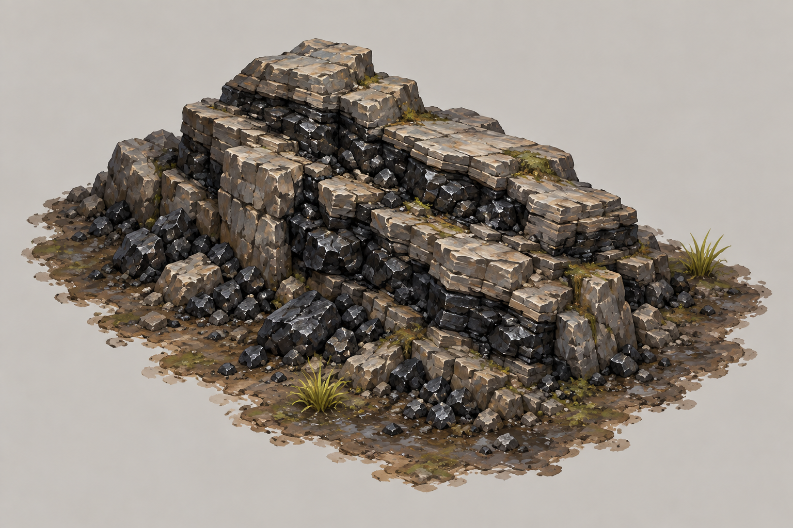
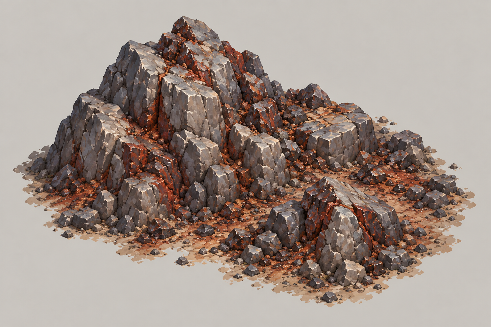
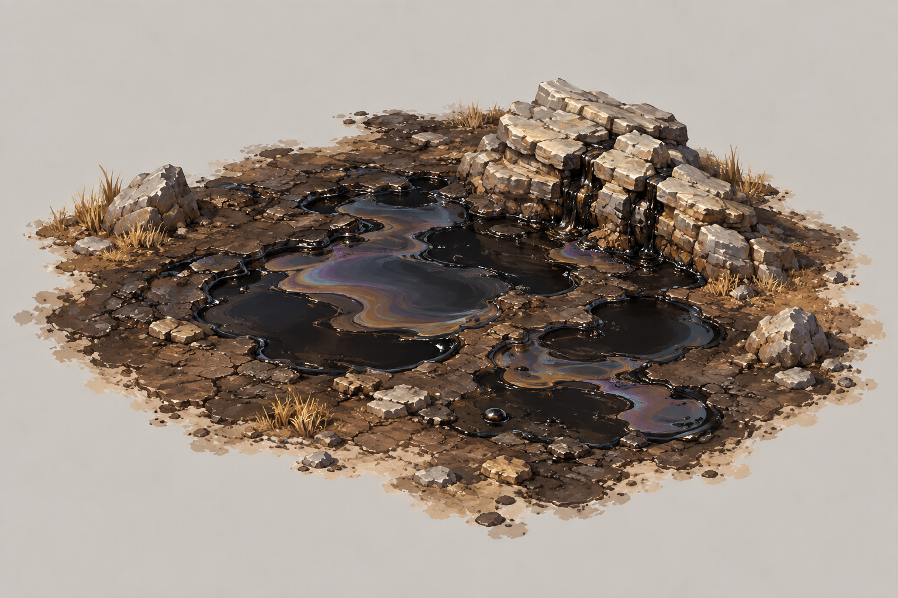
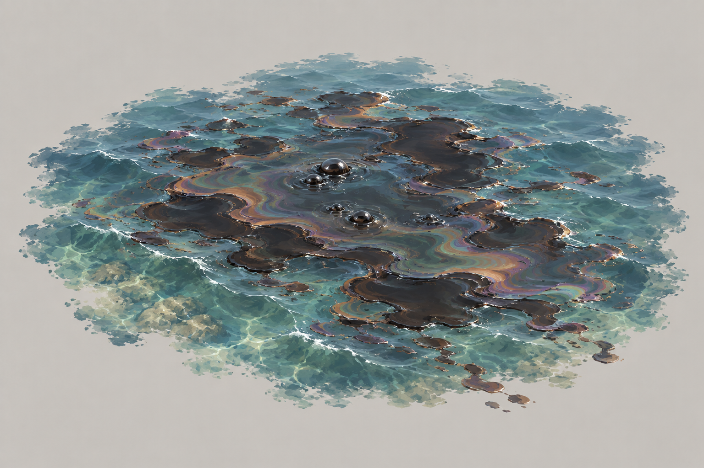
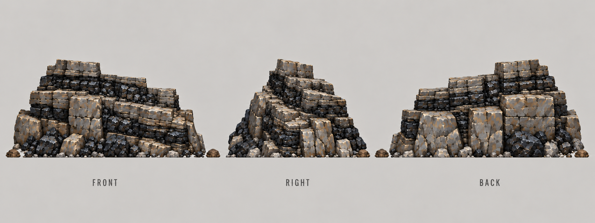
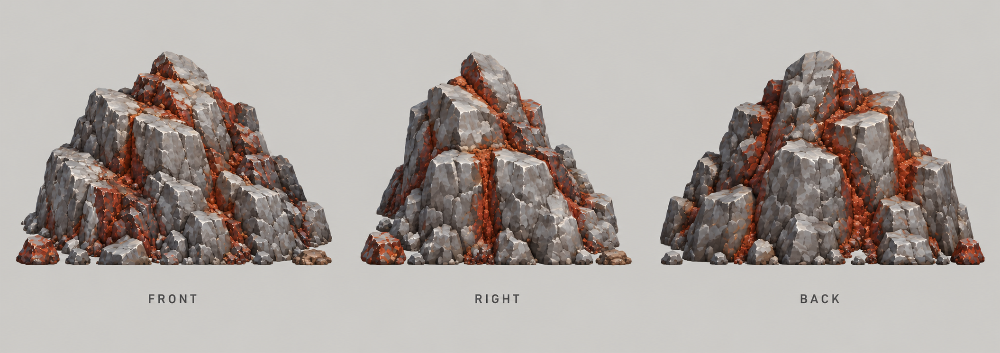
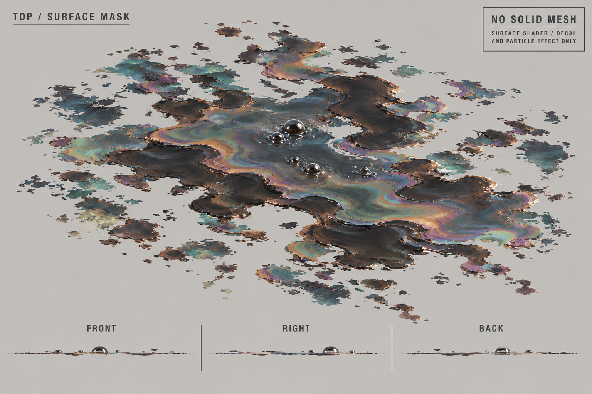

# 地图与资源点

| 文档属性 | 内容 |
|---|---|
| 编号 | SYS-MAP-001 |
| 版本 | v0.9 |
| 更新日期 | 2026-10-08 |
| 状态 | 世界尺寸、资源种类精简、取消深度分级、石油地表可见、矿不会枯竭、出生点 200 米内保底铁矿与煤矿、宝箱存在、迷雾后期加入，已确定；炼钢厂放大加成范围（100 米）已确定；宝箱散落规则、敌人入口为设计提案或待定 |
| 关联代码 | AlienFrontier 项目的 `world_generator.gd`、`resource_generator.gd`、`resource_types.gd`，技术细节见该项目 `docs/world-system.md`、`docs/资源点设计.md` |

[返回文档目录](../../游戏设计文档.md)

**模式与测试用途（2026-10-08用户确认）**：正式只有战役、生存；首战役负责操作教学，生存正常重复游玩。本页保留的S01/S01-L教学参数是内部短测历史对照，不是玩家教学关或每局前置。战役预设内容与正常生存配置分开，具体以[游戏模式与关卡](../游戏模式与关卡.md)为准。

## 1. 世界（已确定）

| 项目 | 内容 |
|---|---|
| 尺寸 | **2048 × 2048 米**（4 km²），固定，不再变大 |
| 生成 | 由种子生成，同一个种子得到同一个世界；约 2.6 秒 |
| 边界 | 四周是海，玩家走到边界会被海自然挡住，不需要隐形墙 |
| 地貌 | 海洋、大陆、湿地、沙漠、森林、雪山、河流、湖泊等 15 种群系 |
| 地形 | 阶地化：每级台阶约 8 米，同一层内平坦可建造，层间用陡坎和坡道连接，保证绝大部分陆地可以走到 |
| 可建造性 | 4×4 米的建筑约 37–40% 的位置放得下 |
| 出生点 | 保证在**最大的大陆**上（世界分为一块主大陆、两块中型大陆和几座小岛，见 6.2），主城建在出生点 |

## 2. 迷雾与可见性

| 项目 | 状态 |
|---|---|
| **现在没有迷雾**：地形从一开始就能看到，玩家知道远处有山、有河 | 现状 |
| **后期会加入迷雾**（已确定），但现在还没有做 | 已确定 |
| 资源信息始终是隐藏的：未勘明的矿点只显示「尚未勘探」，但**地表露头一直画着**，那是发现的途径本身 | 现状，保留 |
| 单位或建筑走近露头约 110 米时自动认出这是什么 | 现状，保留 |

## 3. 资源点种类（已确定，精简）

原来代码里有 12 种资源，现在**只保留 4 种**，与经济设计一一对应：

| 资源 | 用途 | 开采建筑 | 状态 |
|---|---|---|---|
| **铁矿** | 钢铁 | [采矿场](../建筑/经营建筑/采矿场.md) | 保留 |
| **煤矿** | 能源（+300） | 煤矿 | 保留 |
| **陆上石油** | 能源（+400） | 油井 | 保留 |
| **海上石油** | 能源（+800） | 海上石油平台 | 保留 |

**删除的资源：**铜、石料、盐、天然气、地热、稀土、铀、异星晶体。它们在当前的经济设计里没有用途，需要时再加回来。

**魔晶不是矿点资源**，来源是打怪掉落和地图宝箱，见第 6 节。原来代码里的「异星晶体」删除，不作为魔晶的来源。

## 4. 取消深度分级（已确定）

原设计把资源分为地表、浅层、深层三档，需要不同的技术才能找到。**这个机制取消**：所有资源点一视同仁，都是地表可见，走近就能认出。

| 变化 | 说明 |
|---|---|
| 不再有「深度」 | 所有保留的资源点都有地表线索 |
| 石油（陆上、海上） | **地表也可见**（已确定）。海上石油原本没有线索，现在补上海面油膜之类的可见标记 |
| 科技本数 | 与资源无关，只决定能建什么开采建筑：煤矿开局可建，油井和海上石油平台要研究院 2 本 |

## 5. 矿点规则

### 5.1 按成因生成（沿用代码，已实现）

资源不是随机撒点，而是按地貌成因生成，玩家可以从地形推断资源在哪：

| 资源 | 生成位置 | 地表线索 |
|---|---|---|
| 铁矿 | 山脚、裸岩带、有一定坡度 | 锈红色土壤，散落的矿石碎块 |
| 煤矿 | 低洼、平坦、湿润的古沼泽 | 黑色露头 |
| 陆上石油 | 低洼平坦、离海岸有一定距离的内陆盆地 | 油苗渗漏，黑色渗漏区 |
| 海上石油 | 浅海、离岸不远的大陆架 | 海面油膜（新增，已确定石油地表可见） |

### 5.2 成簇分布（沿用代码，已实现）

资源先选出**成矿区**，再在区内放置 1–5 个矿点。找到一个就意味着附近还有，是探索的正反馈。

### 5.3 出生点保底（已确定）

**出生点附近保证有一个煤矿和一个铁矿**（已确定），开局不会因为找不到资源而卡死。

| 项目 | 内容 | 状态 |
|---|---|---|
| 保证的资源 | 一个铁矿、一个煤矿 | 已确定 |
| 距离 | 铁矿和煤矿都在出生点 **200 米以内**（代码里原本是 280 米，收紧到 200 米） | 已确定 |
| 违背地貌时 | 出生点是平原时，保底可能放宽地貌规则，宁可放得有点违和也不让开局卡死；放宽的是地貌适宜度，不是距离 | 沿用代码 |
| 油田 | 不保底，需要探索；油井要研究院 2 本，正好在中期 | 设计提案 |
| 同一连通分量（硬规则） | 保底铁、煤须与出生点处于**同一步行连通分量**；不在同一分量（例如隔水、隔陡坎的飞地）不算保底 | 设计提案（第五轮，原型） |
| 最近可达路径（硬规则） | 首铁、首煤的**最近可达步行路径 ≤ 300 米**（约英雄 3 m/s 回援 100 秒，与生存数值配置的 300 m 示例同一尺度）；不满足则**重采样**种子 | 设计提案（第五轮，原型） |
| 不放宽、不赠矿 | 不放宽 200 米直线保底；不为凑数赠送矿点；不放宽营地 300 米边界 | 设计提案（第五轮，原型） |

说明（第五轮）：200 米是**直线**距离，过去不保证能走到；例如种子 20260918 的 200 米内唯一铁矿步行不可达，最近可达铁矿路径约 427 米，在新规则下该种子会被重采样。**首座矿的距离倍率不一定是 ×1.00**（出生点旁的矿也可能落在 ×1.15 档），第三、四轮经济模型的「×1.00 双矿开局」是乐观值，须按真实种子重算。可达矿点的数量门槛作为可调参数只记录在工作记录中，不写入本文。`resource_types.gd` 中 `base_rate`（铁占位值是设计的 3 倍）与 `footprint` 的代码同步另行处理（AlienFrontier 仓库），本轮不改。

### 5.4 矿不会枯竭（已确定）

**所有矿点都不会枯竭**：采矿场、煤矿、油井、海上石油平台一旦建好，就永久产出。

| 项目 | 内容 | 状态 |
|---|---|---|
| 储量 | 没有储量的概念，不会挖完 | 已确定 |
| 刷新新矿点 | 不需要：世界一次性生成，矿点固定 | 已确定 |
| 一个矿点建几座 | 一个矿点只能建一座开采建筑 | 设计提案 |
| 扩张动力 | 想要更多钢铁和能源，就得占据更多矿点；这些矿点分散在外面，需要视野和防守 | 设计提案 |
| 距离加成 | **离出生点越远的矿点，产出加成越高**，让远处值得去（原代码里「越远储量越高」改为产出加成） | 已确定；具体倍率为设计提案 |

**没有枯竭的后果：**原来「矿挖完了逼玩家往外走」的压力消失了，扩张压力只来自**矿点数量有限**。所以给远处的矿点更高的产出，就成了扩张的主要动力：近处的矿稳，远处的矿富但难守。

### 5.4.1 距离加成（设计提案）

| 距出生点 | 产出倍率 | 界面显示 |
|---|---|---|
| 0–200 m（保底矿） | ×1.00 | ★ |
| 200–500 m | ×1.15 | ★★ |
| 500–900 m | ×1.30 | ★★★ |
| 900 m 以上 | ×1.50 | ★★★★ |

| 规则 | 内容 |
|---|---|
| 适用范围 | 四种开采建筑都适用：采矿场（钢铁）、煤矿、油井、海上石油平台（能源）的产出乘以所在矿点的倍率 |
| 界面 | 沿用代码里的「星级」显示：原来的储量星级，改为产出星级，玩家指向已发现的矿点就能看到 |
| 与炼钢厂 | 相乘：采矿场产出 = 基础产出 × 距离倍率 × （1 + 炼钢厂加成） |
| 上限取 ×1.5 | 比代码原来的 1.85 倍低，因为能源建筑也吃这个倍率，倍率太高会让远处的海上石油平台产出过大 |
| 代价 | 远处的矿离基地远、需要视野和防守，[隐形哨塔](../建筑/军事建筑/哨塔.md)在这里派上用场 |

原型测试基线：采矿场基础每分钟 20 钢铁，出生点 1000 米外为 20 × 1.5 = 30；配首座炼钢厂（+50%）则为 20 × 1.5 × 1.5 = 45。基础产量见[采矿场](../建筑/经营建筑/采矿场.md)，炼钢厂递减与覆盖见其独立文档；不沿用旧 10 / +30% 示例。

### 5.5 炼钢厂的范围与矿点间距（已确定：放大范围）

[炼钢厂](../建筑/经营建筑/炼钢厂.md)的作用是「给它旁边的采矿场加成」，范围目前是 **25 米**。

问题在于：真正生成的世界里，同一片铁矿区里相邻两个矿点隔得比较远（种子 20260918 实测：全部 34 个铁矿点的最近邻间距中位数 **68.4 米**，与出生点连通的 9 个可达点中位数 **144.6 米**）。一座炼钢厂只能照顾 25 米内的采矿场，够不到隔了 100 米以上的下一个矿点，结果就是**一座炼钢厂通常只能给一座采矿场加成**，没法「一座炼钢厂带好几座采矿场」，设计文档里「矿场越多，炼钢厂越划算」的想法就用不上了。

两种解决办法：

| 方案 | 做法 | 评价 |
|---|---|---|
| A. 放大炼钢厂范围 | 把加成范围从 25 米放大到 60–100 米 | 只改一个数字，不用动生成器 |
| B. 让铁矿靠得更近 | 调整生成器，让同一片矿区里的铁矿点靠近到约 40 米 | 矿点更集中，一座炼钢厂就能覆盖一组，「成簇」的效果也更强 |

**已确定选 A**：把炼钢厂的加成范围放大到 **100 米**（数值为设计提案），不改生成器。100 米的范围约等于同一片矿区里相邻矿点的间距，一座炼钢厂基本能照顾整片矿区；100 米保留，按该种子实测最多覆盖 4–5 个矿点（可达子集 4 个、全部 5 个）。

## 6. 宝箱（已由野外营地取代，见出怪系统）

| 项目 | 内容 | 状态 |
|---|---|---|
| 是否有宝箱 | 宝箱的机制由**野外营地**承担：摧毁营地就是开宝箱（已确定）。营地不出怪，与敌人传送门分开，见[出怪系统](出怪系统.md) | 已确定 |
| 内容 | S01固定50魔晶；S02固定C魔晶或2C钢铁二选一，不附随机金币，见6.1.2 | 双主策采纳的原型规则 |
| 开启 | S01清除登记守卫并摧毁营地后固定到账；S02同条件解锁补给选择，见6.1.2，不要求英雄到场 | 已采纳原型规则 |
| 守卫 | 营地本身就有绿皮驻守 | 已确定 |
| 散落规则 | 数量、分布、距离，见下 | **待定** |

### 6.1 散落规则（设计提案；下表的「宝箱」现在指「营地」）

原设计写「距主城约 60–150 m」，但世界是 2048 米，这个尺度太小。建议按距离分带：

| 距出生点 | 宝箱数量 | 内容 | 守卫 |
|---|---|---|---|
| 0–300 m | 不放营地 | — | — |
| 300–700 m | 近程探索区，数量随主大陆可达面积配置 | 原型魔晶数C为30–50；S02可改选2C钢铁 | 小股驻守绿皮 |
| 700 m 以外 | 约 24 个 | 原型魔晶数C为50–60；S02可改选2C钢铁 | 大多有守卫 |

| 规则 | 提案 |
|---|---|
| 位置 | 放在玩家走得到的平台上，不放在悬崖或孤岛，用世界的可达性数据过滤 |
| 间距 | 营地之间至少相隔 100 米，不与矿点、出生点重叠；固定测试配置也要满足 |
| 可见性 | 宝箱是否有远距离可见的标记，待定；建议宝箱本身有微光，走近可见，不加地图标记。（第五轮「营地可见性」提案见 6.1.3，与此建议不同，作为替代候选，未定） |
| 刷新 | 世界一次性生成，摧毁后不再补充（营地只当宝箱，不出怪，见出怪系统 3.2） |

全世界约40个营地只是生成目标，不代表出生大陆可取得全部奖励。法师营地升至3本累计需400魔晶，建魔法塔还要另付；必须用实际可达营地、守卫与路径验算，不用全世界总额证明前期供应。

### 6.1.1 生存配置的地图供给校验（原型基线）

S01 教学固定测试配置在主大陆放置4个可达营地，每个奖励50魔晶（沿用30–60范围内的固定取值），合计200。它们距出生点至少300米、互距至少100米，必须逐个计入往返/连续远征路线、守卫战斗和英雄离家风险；不是开局自动发放，也不假设两营地即够100。守卫、营地生命及取得时间见[生存数值配置](生存数值配置.md)。

S02 完整局的近矿、后续矿、煤矿与营地分布由配置给出最低供给和可达条件，按阶段资源账验证。奖励下限、守卫难度和额外塔的材料均应扣除。随机生产种子若不满足供给/路径约束，需要重采样或显示配置不适用；不能把跨海奖励计入尚未有船的路线。

这些是测试地图的条件，尚未改游戏地图生成代码。验证时保存种子和路径；离线合成路径通过不等于已经验证真实生成地图。

### 6.1.2 营地补给选择（双主策修改采纳的原型规则）

S01教学不开材料二选一：四营地各固定50魔晶，登记守卫清零且营地建筑被摧毁后一次到账，合200。该供应仍须真实清营才能取得，不保证时间或英雄经验。统一教学守卫为每营4普通绿皮+1弓手（6威胁点）；旧报告的6普通守卫只是撤回的算式示例，不能用于当前守卫生命、经验或战斗时长。

S02及独立S02-G配置在生成营地时固定C，清除该营地登记的全部守卫并摧毁营地后，解锁“C魔晶 / 2C钢铁”二选一。允许任意友方作战单位完成，不额外要求英雄到场；波次敌人、路过敌人不计入营地清场。玩家从营地标记或补给列表选择，战斗不暂停，关闭面板保留待领，不自动代选；选定后一次到账、不可反选、不可重复领取。存档保存营地ID、守卫归属、待领和已领选项，重载不重新生成奖励。该原型不附随机金币或额外钢铁，替代旧“魔晶为主并随机附其他资源”的奖励。

选择面板显示两种数量、当前储备及已解锁下一项的材料需求。2:1是待测试参数，不代表两种奖励已等价。500/680魔晶候选供应仅在相应营地全部选魔晶时成立；选择钢铁后从同一营地魔晶账扣除，不预支未领取或末波掉落。

营地不提供追加兑换或改选；既有魔法2本[炼金坊](../建筑/经营建筑/炼金坊.md)保留，依照建造成本、能源、差汇率和全基地每日额度应急。第一座法师营地之前不能靠炼金坊兜底，使用其收益必须付齐前置与兑换消耗。

首个可玩切片暂缓跨海施工与高级海军，S01/S02必须在主大陆提供核心矿点、能源与营地路线；海外资源不能补首版通关预算。发布菜单、科技奖励、任务与卡池共同过滤暂缓内容，跨海资料与艺术图稿保留。

**备注：营地遗物实验（实验，默认关；设计提案，第五轮）。**上文二选一与[任务系统](任务系统.md)「奖励只能通过任务获得」均**不改**。仅在试玩配置里让约 1/4 的营地给「遗物」，作为补给的**第三个选项**（C 魔晶 / 2C 钢铁 / 遗物，不是额外附送）；保守替代是 S02 唯一任务固定为「去某营地取遗物」。若转正，迁移影响有三：补给由二选一变三选一；重算 500 / 680 魔晶供应；寻宝人与遗物功能重叠，需二选一。

### 6.1.3 营地可见性（原型，设计提案，第五轮）

补充「标记待定」。未经真人试玩，不是已确定规则。

| 项目 | 内容 |
|---|---|
| 显示时机 | 营地进入任一己方单位或建筑的视野后，**永久显示标记**（不随视野丢失而消失） |
| 标记内容 | 方位、距出生点距离、守卫档（3 档图标，对应 6 / 8 / 10 点档）、奖励类型 |
| 状态 | 清场后显示「待领」，领取后变灰 |
| 不揭示 | 标记不揭示传送门位置 |
| 实验开关 | 「出生时即显示最近的一个营地」是**实验开关，默认关**；开启与否待试玩观察 |

### 6.1.4 营地守卫梯度与脱战（设计提案，第五轮）

| 项目 | 内容 |
|---|---|
| 近程带（距出生点 300–700 m） | 营地守卫**一律 6 点档**（与 S01 教学守卫 4 普通绿皮 + 1 弓手同档） |
| 700 m 以外 | C 为 41–50 的营地为 **8 点档**；**10 点档仅作试玩配置，不进基线** |
| 守卫构成 | 只含普通绿皮与弓手，**不含魔免敌人** |
| 脱战回位 | 守卫被引出营地超过 **40 m** 后脱战回位。这是守卫的例外，不改「波次敌人不撤退」，见[出怪系统](出怪系统.md) |

**剩余阻断（魔晶 / 营地供给账未闭合）：**原型代码（AlienFrontier）尚未实现营地生成，无法按真实种子统计。必须先实现营地生成，再统计可达营地数、距离带与 C 合计，并对照魔法路线的需求时间线；在此之前，营地与魔晶的供应数字只是设计规则，不是已验证的供给账。

## 6.2 其他大陆与跨海（新增）

### 大陆布局（已实现，参数可调）

世界不再是「中间一整块大陆、四周是海」，而是分成几块被海峡隔开的陆地：

| 类型 | 数量 | 大小 | 作用 |
|---|---|---|---|
| 主大陆 | 1 | 占陆地约 58%–76% | **出生点一定在这里**，有基础资源、平缓地形，供前期发展 |
| 中型大陆 | 2 | 各约 10%–20% | 隔海，需要造船厂/运输舰才能到，矿更远、更富 |
| 小岛 | 3 | 很小 | 适合放宝箱、海上石油、少量矿点 |

- 陆地约占世界 50%–57%，海峡宽约 100 米。
- 10 个种子实测：3–8 块陆地，几乎没有碎岛渣，出生点全部在最大陆块上。
- 小陆块山脉更矮更缓，不会出现「一座小岛全是雪山」。

**好玩的地方（设计意图）：**
1. 前期只在主大陆发展，环境安全、目标明确。
2. 中期造船厂解锁后，出海是一次明确的「第二阶段」，与距离加成（最高 ×1.5）配合。
3. 不同大陆纬度不同，气候与群系不同，各有特色。
4. 海峡是天然屏障，也是敌人入口设计的依据（见第 7 节，待定）。

**待定：**主大陆占比是否合适、海峡宽度、每块大陆的资源分配、敌人是否从海上登陆。

### 跨海手段

世界四周是海，海上还有与主大陆隔开的岛屿和大陆。玩家想去那里，需要：

| 手段 | 说明 |
|---|---|
| [造船厂](../建筑/军事建筑/造船厂.md) | 在海岸建造，造[运输舰](../单位/运输舰.md)载着人跨海，是到其他大陆的唯一手段 |
| [传送阵](../建筑/军事建筑/传送阵.md) | 远距离移动，**可以连接不同大陆**（已确定）；第一次登陆仍需要运输舰把开拓者送过去 |

**设计含义：**其他大陆上的矿点和宝箱是需要跨海才能拿的「远方的富矿」，适合放最高的产出倍率和守卫最强的宝箱。这条与[距离加成](#541-距离加成设计提案)配合：离出生点越远越富，而隔海的大陆本身就很远。

## 7. 敌人入口（传送门，见出怪系统）

绿皮从迷雾中随机刷出的**传送门**出来，见[出怪系统](出怪系统.md)。路线仍取决于地形骨架（山脉、河流、海岸）。

## 8. 对其他文档的影响

| 文档 | 需要改的地方 |
|---|---|
| [采矿场](../建筑/经营建筑/采矿场.md) | 已同步：出生点保证有铁矿、200 米内、矿不会枯竭 |
| [炼钢厂](../建筑/经营建筑/炼钢厂.md) | 已同步：取消储量和枯竭，加成范围放大到 100 米，见 5.5 |
| [核心玩法循环](../核心玩法循环.md) | 已同步：营地一次性生成、不刷新，移除旧60–150米距离，按本节和配置校验可达供应 |
| [能源体系](能源体系.md) | 已同步：煤矿不枯竭，出生点保证有煤矿 |
| [科技系统](科技系统.md) | 取消深度分级后，勘探与科技本数不再挂钩 |

## 9. 待设计内容

| 项目 | 需确定内容 |
|---|---|
| 矿点数量 | 沿用生成器（铁 9 个成矿区×2–5、煤 8×2–5、陆上油 5×2–4、海上油 5×2–5），**不另设数量表**；首版平衡以出生点连通的主大陆可达子集为准，见 5.3 硬规则（第五轮结论，设计提案）；油田点数量少于煤、但距离更远 |
| 采矿速度 | 设计值：采矿场基础 20 钢/分，煤 / 陆上油 / 海上油为能源供给点数 300 / 400 / 800，均乘距离倍率；距离倍率分档 1.00 / 1.15 / 1.30 / 1.50 经真实种子核对**不改**（×1.50 层主要服务跨海）。代码 `base_rate` 为占位值，同步另行处理（AlienFrontier 仓库） |
| 宝箱 | 数量、分布、可见性是否合适 |
| 迷雾 | 何时加入，与勘探、哨塔视野如何配合 |
| 敌人入口 | 绿皮出生点与路线 |
| 海上石油 | 出生点附近是否保证能找到海上石油 |

## 10. 版本记录

| 版本 | 日期 | 变更 |
|---|---|---|
| v0.1 | 2026-09-30 | 建立文档：整理世界规则；资源精简为 4 种；取消深度分级；出生点保底铁矿与煤矿；宝箱存在，规则待定；迷雾后期加入 |
| v0.2 | 2026-09-30 | 确定石油地表可见、矿不会枯竭、保底距离 200 米；取消储量、枯竭与刷新新矿点；重写炼钢厂范围问题的说明 |
| v0.3 | 2026-09-30 | 确定离出生点越远的矿点产出加成越高；加入距离倍率分档提案（×1.0 到 ×1.5） |
| v0.4 | 2026-09-30 | 地图改为多大陆（主大陆+2中型+3小岛），出生点在最大陆块；加入大陆布局说明与实测数据 |
| v0.4.1 | 2026-09-30 | 宝箱改由野外营地承担：摧毁营地即开宝箱；营地按大陆补充 |
| v0.4.2 | 2026-09-30 | 营地不出怪、只当宝箱，不再补充；敌人入口改回随机刷出的传送门 |
| v0.5 | 2026-10-08 | 数值迭代：统一营地最低距离/守卫/间距、教学固定供给与实际路径边界；同步采矿20和首厂50%的例子，不用全图资源额证明早期可达 |
| v0.6 | 2026-10-08 | 双主策采纳：S02营地固定材料二选一、S01固定魔晶与统一守卫、一次领取边界，保留炼金应急；首版资源按主大陆校验 |

## 未开发资源点美术（2026-10-01）

| 资源 | 概念稿 | 识别特征 |
|---|---|---|
| 煤矿 |  | 黑色煤层露头、灰褐沉积岩 |
| 铁矿 |  | 锈红矿脉、氧化染色及碎矿石 |
| 陆上石油 |  | 黑色油苗渗漏与浅油池油膜 |

均为未建设开采设施的天然资源点，采用项目手绘风格；不包含矿井入口、机械或人工设施。图稿及提示词见[资源点概念稿索引](../美术/资源点/资源点概念稿索引.md)。

海上石油补充：未开发海上油田概念稿，以浅海油膜、自然渗油气泡与涟漪表示资源点，不包含平台或船只。

### 未开发资源点建模设计稿

概念图中的环境仅用于表达资源特征。制作可放置资产时，不建整片泥土地面、地形底盘、水体或植被；保留主岩体、矿块、独立碎石和具有体积的结块脏土。碎石和土块建议拆为散布件，便于适应真实地图地形。

| 资源 | 当前建模设计稿 | 实体与效果范围 |
|---|---|---|
| 煤矿 |  | 层岩、煤层、煤块、碎石和少量土块 |
| 铁矿 |  | 岩体、锈红矿脉、碎矿石和少量土块 |
| 陆地油田 |  | 裂岩、碎石和土块为实体；岩面油污用材质，地表油池另做贴花或液面效果 |
| 海上油田 |  | 使用地图现有海面；油膜及气泡独立制作，不增加水体或岩岛 |

三视图为形体和拆件参考，实际尺寸与背面结构在同一白模中统一。详细接地、拆件及材质要求见[资源点建模说明](../美术/资源点/资源点建模说明.md)。

## 第三轮营地实体与地图验收

营地建筑原型300生命/0甲，不攻击、不产怪，建筑无经验；登记守卫实际清零且拆营完毕才解锁奖励。英雄不在家时不能计家中输出或附近经验；阵亡兵不继续贡献，治疗仅计算范围内实际治疗。两营65/轻守卫只归S01-L候选，不覆盖本页默认S01四营50。

地图验收先验证出生200米内铁/煤存在，再验证工人可到作业点、矿场可落基、连接主大陆通道与可守阵地；距离近不等于可用。保存种子、地图版本、实际路线点/长度、地基与施工记录，失败重采样或拒绝配置，不赠矿、不放宽营地300米边界。

真实生成器seed20260918的派生4米坡/水深网格中，近铁直线89.65米但网格不可达，最近可达铁派生路线427.24米；原四营坐标仅两处有可达近邻。此为地图风险样本，不是Actor导航缺陷定论，也不能宣称全部种子已验收。实际导航、单位碰撞与建筑地基尚需引擎验证，合成×1.25路线只归独立fixture。来源：[真实地图抽样](../../工作记录/数值迭代-2026-10-08/第三轮-真实地图抽样与验收.md)。

### 第三轮版本记录

| 版本 | 日期 | 变更 |
|---|---|---|
| v0.7 | 2026-10-08 | 营地300HP/零经验与真实地图路径/地基验收；原型规则，未宣称实机或真人通过 |

| 版本 | 日期 | 变更 |
|---|---|---|
| v0.8 | 2026-10-08 | 同步战役/生存用途，S01仅内部对照 |
| v0.9 | 2026-10-08 | 第五轮同步：§5.3 保底铁煤同连通分量与首铁/首煤路径≤300 m 硬规则（设计提案）；§5.5 间距改种子 20260918 实测；§6.1.2 备注营地遗物实验（默认关）；新增 6.1.3 营地可见性、6.1.4 守卫梯度与魔晶供给账未闭合注记；§9 矿点数量与采矿速度写入结论 |
