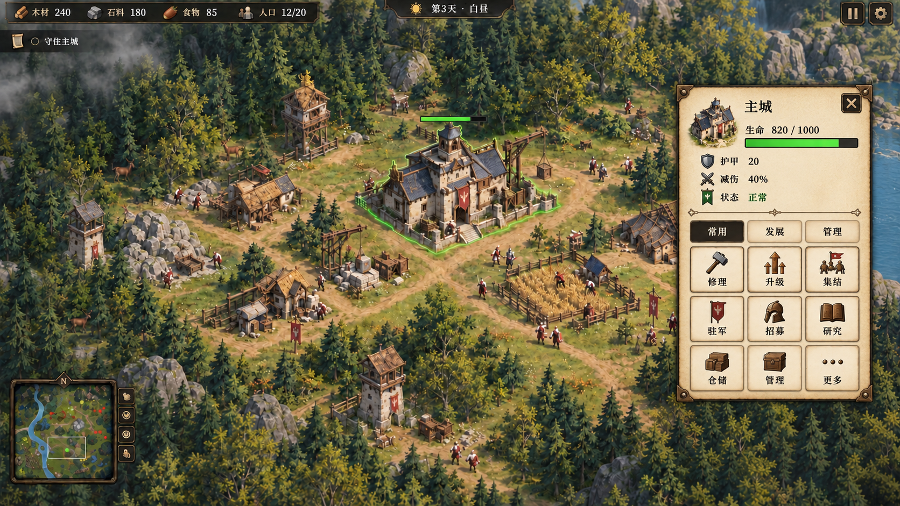

# UI 样品 · 羊皮纸悬浮面板

保存日期：2026-09-26  
状态：**仅为样品，非定稿，不作为实现依据。**

[返回文档目录](../../../游戏设计文档.md)

## 样品图

## 参考范围

本图按用户要求作为样品保留，用于参考完整游戏画面中右侧长方形羊皮纸悬浮面板的整体效果。面板具有完整纸面，四周露出游戏画面；“悬浮”不指面板内部挖空。

图中上方为选中对象信息与属性，下方为分类和操作按钮。面板的位置、尺寸、属性排列、分类方式及按钮数量均未定稿；不同建筑或角色可以有不同属性和操作，不以样品中的九个按钮为固定规格。

图中资源、当前血量、状态、建筑功能、操作名称及场景内容仅用于视觉演示，不新增或确认任何玩法设定。已有正式数值仍以对应设计文档为准。

## 出图记录

使用内置 imagegen 工具，以前一版完整游戏界面为参考编辑生成。

生成要求摘要：保留俯视角森林基地、选中主城、顶部资源信息和左下角小地图；将右侧面板改为更小的独立竖向长方形羊皮纸浮层，保留完整纸面、细皮革边缘和轻微投影，面板四周可见游戏画面；内部紧凑排列名称、生命条、护甲等示意属性，以及分类页和多行示意操作按钮。输出完整游戏画面，用于视觉样品。
